# Product Requirements Document (PRD)

**Product:** FitVibe – Training Planner & Logger Web App  
**Author:** Konstantinos  Pilpilidis
**Revision:** v1.2  
**Date:** 2025.10.03

---

## Table of Contents

1. **Vision**

2. **Context, Scope & Goals**  
   - 2.1 Goals  
   - 2.2 Scope (MVP)  
   - 2.3 Future Improvements

3. **Users & Use Cases**  
   - 3.1 Personas  
   - 3.2 Core Use Cases

4. **Functional Requirements (FR)**  
   - FR-1 User Management & Security  
   - FR-2 Profile & Settings  
   - FR-3 Exercise Library  
   - FR-4 Sessions  
   - FR-5 Progress & Analytics  
   - FR-6 Points System  
   - FR-7 Sharing & Community  
   - FR-8 Internationalization (i18n)

5. **Non-Functional Requirements (NFR)**  
   - 5.1 Security  
   - 5.2 Privacy & GDPR  
   - 5.3 Performance  
     - 5.3.1 General Targets  
     - 5.3.2 Per-Endpoint Budgets  
     - 5.3.3 Frontend Budgets  
     - 5.3.4 Backend Constraints  
     - 5.3.5 Database Performance  
     - 5.3.6 Testing & Validation  
   - 5.4 Availability  
   - 5.5 Accessibility  
   - 5.6 Observability  
     - 5.6.1 Additions for Performance Monitoring  
   - 5.7 Backup & Disaster Recovery  
   - 5.8 Modularity & Extensibility  
   - 5.9 Security Threat Model (MVP)

6. **Technology**  
   - 6.1 Technology → Purpose Map (canonical)  
   - 6.2 Rationale  
   - 6.3 Frontend Stack  
   - 6.4 Backend Stack  
     - 6.4.1 API Route Overview (MVP)  
     - 6.4.2 Layer Contracts  
     - 6.4.3 Error Handling Specification  
     - 6.4.4 Testing Approach  
     - 6.4.5 Migration Conventions  
     - 6.4.6 Logging & Monitoring Middleware  
   - 6.5 Database & Persistence  
   - 6.6 Infrastructure & DevOps  
   - 6.7 Configuration & Secrets  
   - 6.8 Environments  
   - 6.9 Build & Release  
     - 6.9.1 Rollback Policy & Feature Flags  
   - 6.10 Observability & Monitoring  
     - 6.10.1 Monitoring stack  
   - 6.11 Data Protection & Privacy  
   - 6.12 Monorepo Tooling  
   - 6.13 Operability Runbooks  
   - 6.14 Internationalization & Localization (i18n / l10n)  
     - 6.14.1 Purpose  
     - 6.14.2 Architecture Overview  
     - 6.14.3 User Experience Requirements  
     - 6.14.4 Testing & QA  
     - 6.14.5 Roadmap & Future Extensions  
     - 6.14.6 Dependencies & Configuration  
     - 6.14.7 Security & Compliance  
     - 6.14.8 Success Metrics

7. **Data Model & Structures**  
   - 7.1 Logical Overview  
   - 7.2 ERD  
     - 7.2.1 ERD (Mermaid)  
     - 7.2.2 Key Constraints & Performance Notes  
     - 7.2.3 Mapping Notes  
   - 7.3 Entities & Key Fields (Data Dictionary)  
   - 7.4 Foreign Keys & Cascades  
   - 7.5 Indexing Strategy (Summary)  
   - 7.6 Partitioning & Retention  
   - 7.7 Materialized Views & Denormalization  
   - 7.8 Migration Notes (DDL Highlights)  
   - 7.9 Compliance Note  
   - 7.10 Lookup Normalization Tables

8. **User Experience (UX)**  
   - 8.1 Key Screens  
   - 8.2 UX Design Principles  
   - 8.3 User Journeys  
   - 8.4 Visual Design System  
     - 8.4.1 Design Philosophy  
     - 8.4.2 Brand Color System  
     - 8.4.3 Depth & Shadow System  
     - 8.4.4 Light / Dark Mode Specification  
     - 8.4.5 Component Style Tokens  
     - 8.4.6 Logo & Brand Symbolism  
     - 8.4.6.1 Branding  
     - 8.4.7 Typography System  
       - 8.4.7.1 Design Principles  
       - 8.4.7.2 Typefaces  
       - 8.4.7.3 Typographic Scale  
       - 8.4.7.4 Implementation Guidelines  
     - 8.4.8 Accessibility & Contrast

9. **Authentication Lifecycle**  
   - 9.1 Account Creation  
   - 9.2 Login  
   - 9.3 Session Management  
   - 9.4 Logout  
   - 9.5 Password Management  
   - 9.6 Token & Key Management  
   - 9.7 Account Recovery & Deletion  
   - 9.8 Future Extensions (Phase 2+)  
   - 9.9 Authentication Security Risk Table

10. **Backlog Items**  
    - 10.1 Backend Backlog  
    - 10.2 Frontend Backlog

11. **Project Structure**  
    - 11.1 Rationale  
    - 11.2 CI/CD Workflow  
      - 11.2.1 Local Development  
      - 11.2.2 Code Standards  
      - 11.2.3 Testing  
      - 11.2.4 Continuous Integration (CI)  
      - 11.2.5 Continuous Deployment (CD)  
      - 11.2.6 Documentation  
      - 11.2.7 DevSecOps Enhancements  
    - 11.3 Governance, Security & Compliance  
      - 11.3.1 Governance  
      - 11.3.2 Security Controls  
      - 11.3.3 Compliance & Monitoring  
      - 11.3.4 CI/CD + Compliance Diagram  
      - 11.3.5 Summary Table  
      - 11.3.6 Performance Governance  
    - 11.4 Contribution Guidelines  
      - 11.4.1 Branching Strategy  
      - 11.4.2 Pull Requests (PRs)  
      - 11.4.3 Commit & Release Policy  
      - 11.4.4 Code Ownership & Branch Protection  
      - 11.4.5 Security Expectations for Contributors  
      - 11.4.6 Documentation & ADRs

12. **Glossary**

---

## List of Tables

| Table No. | Title                              | Section |
| --------- | ---------------------------------- | ------- |
| Table 6.1 | Technology Stack (Master Table)    | 6.1     |
| Table 9.1 | Authentication Security Risk Table | 9.9     |

---

## List of Figures and Graphs

| Figure No.  | Title                                                         | Section |
| ----------- | ------------------------------------------------------------- | ------- |
| Figure 6.1  | High-Level Architecture (Mermaid)                             | 6.1     |
| Figure 7.1  | Entity Relationship Diagram (ERD)                             | 7       |
| Figure 8.1  | User Journey: Registration & Account Activation               | 8.3     |
| Figure 8.2  | User Journey: Plan & Log a Session                            | 8.3     |
| Figure 8.3  | User Journey: Discover & Clone a Session                      | 8.3     |
| Figure 8.4  | User Journey: Update Profile or Archive Account (with Errors) | 8.3     |
| Figure 8.5  | User Journey: Update Profile or Archive Account               | 8.3     |
| Figure 9.1  | Authentication Lifecycle Diagram                              | 9       |
| Figure 11.1 | CI/CD Workflow Diagram                                        | 11.2    |

---

## 1. Vision

FitVibe is a platform where users can upload and plan training sessions expanding over all domains of fitness:

- Strength: olympic weightlifting, powerlifting, strongman, body building
- Agility: juggling, climbing, bouldering, calisthenics, gymnastics, parkour,
- Endurance: running, hiking, cycling, rowing, jump rope
- Speed and explosivity: Sprints, jumps, throws or
- Hybrid exercises: boxing, hyrox

It enables individuals to **plan, log, share, and track** their training sessions with a clear, accessible, and responsive interface. The system is designed with a **modular, scalable architecture** and strict **separation of concerns**, ensuring sustainable growth and easy extensibility (e.g., nutrition tracking, wearables integration, AI recommendations).

The system shall follow a **security-first design** and guarantee full **GDPR compliance**, including privacy-by-default settings and user-controlled data management.  
Accessibility shall be central, following **WCAG 2.1 AA standards**, providing a barrier-free experience across devices and user groups.

---

## 2. Context, Scope, and Goals

### 2.1 Goals

The system shall:

- Provide an **easy-to-use interface** for planning and logging training sessions.
- Enable **fast entry and retrieval** of exercises and sessions.
- Facilitate **sharing and community engagement** with robust privacy controls.
- Offer **progress tracking** with historical data and analytics.
- Deliver a **gamified experience** via a hidden points system.
- Ensure an **accessible and responsive UI** (WCAG 2.1 AA).
- Guarantee **security-first user management** (2FA, brute-force protection, password policy).
- Support **scalability and modularity** for future enhancements.

### 2.2 Scope (MVP)

**In Scope (MVP):**

- User accounts, profiles, and secure authentication.
- Personal Exercise library: Every authenticated user can create and manage their own custom exercises.
- Global Exercise library: Admins can still edit or delete system-wide (shared) exercises, but users can add personal ones that appear only in their own planner/logger.
- Planning and logging sessions, as series of exercises done one-after-the-other.
- Points awarded upon session completion.
- Progress dashboard (history and charts).
- Public feed of sessions with privacy controls.
- Foundation-level admin dashboards for moderation.
- English (**en**) and German (**de**) static translations for all UI and system text.  
- Language detection based on browser preference or user profile.  
- Locale-aware date, number, and unit formatting.  
- Automatic AI translation of user-generated content (feed, sessions, comments) via external API (OpenAI).  
- Caching of translated texts for performance and cost control.  

**Out of Scope (MVP):**

- Third-party integrations (Garmin/Strava).
- Nutrition tracking and body composition analytics.
- AI coach and adaptive recommendations.
- Real-time chat or advanced social features (likes, comments, leaderboards).
- Native mobile apps (progressive web app acceptable for MVP).
- Manual translation workflows or in-app translation editing.  
- Voice or speech translation.  
- RTL (right-to-left) language support.

### 2.3 Future Improvements (Post-MVP)

- Third-party wearable integrations (Garmin/Strava).
- Real-time chat and social graph.
- Nutrition tracking and advanced body analytics.
- AI-based training recommendations.
- Expanded gamification (badges, leaderboards, streaks).

---

## 3. Users and Use Cases

### 3.1 Personas

- **Member (Athlete):**

  - Plans and logs workouts.
  - Reviews progress.
  - Attains points and badges.
  - Shares sessions.

- **Administrator:**

  - Moderates content.
  - Manages selectable values.
  - Monitors community rule violations.

- **Follower:**
  - Watches the progress of athletes.
  - Gives feedback on logged sessions.
  - Comments on logged sessions and exercises.

### 3.2 Core Use Cases

The system shall enable users to:

1. **Plan a session** with exercises and attributes; save as draft or scheduled.
2. **Log a session**; record actual performance; mark complete; receive points.
3. **Browse the feed**; view or clone public sessions into the planner.
4. **Manage accounts**; edit profile, avatar, and security settings; export or delete data.
5. **Administer the platform**; configure selectable lists, review reports, moderate community content.

---

## 4. Functional Requirements (FR)

> Each FR includes **Acceptance Criteria (AC)** and, where relevant, **Error Behaviors (EB)**.

#### FR-1 User Management & Security

- **Registration** with verified email (15-minute TTL token, 3 resend/hour, auto-purge in 7 days).
  - **AC:** Duplicate usernames rejected (case-insensitive).
- **Login** with username/password; optional 2FA (TOTP + backup codes).
  - **EB:** Generic error messages, no user enumeration.
- **Password policy:** ≥12 chars, must include upper, lower, number, symbol.
- **Brute force protection:** max 10 failed attempts → exponential backoff, lock, optional CAPTCHA, user notified.
- **Logout** invalidates refresh session (rotated per use, revoked by `jti`).
- **Password reset** via single-use link (15 min TTL, audit logged).
- **Account deletion (GDPR):** hard deletion within 30 days (with exceptions for audit/legal); queued deletion from backups.
- **Data export:** JSON of profile, sessions, exercises, points (link valid 24h).
- **Roles & authorization:** `user` (default) and `admin`, enforced server-side.

#### FR-2 Profile & Settings

- **Editable:** alias, weight (+unit), fitness level, avatar (max 5MB jpeg/png/webp).
- **Immutable:** date of birth, gender (man, woman, diverse, prefer not to say).
- **Training frequency** stored for personalization.
- **Avatar:** 128×128 preview, placeholder if absent.

#### FR-3 Exercise Library

- Create, edit, archive exercises with attributes (name, category: cardio/strength/power-endurance, muscle group, tags).
- **Default visibility:** private; public exercises discoverable.
- Safe delete = archive (hidden from selectors, retained for history).
- **Reuse across sessions:** snapshot of name retained in session_exercises for historical accuracy.

#### FR-4 Sessions

- **Plan sessions** for specific date/time or recurring template (time-zone aware, DST safe).
- **Log actuals**; mark completed/canceled; compare planned vs actual.
- **Clone & modify** own or public sessions (attribution retained).
- **Visibility:** private (default) or public; switching never leaks past data.
- **Archival:** sessions archived, not deleted, for historical traceability.

#### FR-5 Progress & Analytics

- **History view** with filters (date, category, visibility).
- **Charts**: volume, duration, distance, intensity, frequency.
- **Summaries**: weekly, monthly, yearly.
- **Personal bests & streaks** tracked.

#### FR-6 Points System

- Awarded server-side upon session completion.
- Formula inputs: calories (if available), age, gender, fitness level, frequency, RPE.
- **AC:** Users see awarded points only, not formula.
- Anti-gaming: bounds checking, device/IP heuristics; manual admin adjustments logged.

#### FR-7 Sharing & Community

- Authenticated feed of public sessions with search/sort.
- Clone public sessions into planner (attribution preserved).
- Reporting & moderation placeholders (future admin UI).
- **Policy:** default privacy is private; community guidelines apply.

#### FR-8 Internationalization (i18n)

- **Language Detection**: The system shall detect the user’s preferred language via browser headers or stored profile preference.
- **Static UI Translation**: All visible system UI elements shall be translated using predefined token dictionaries (JSON resources).
- **Dynamic AI Translation**: User-generated text (e.g., session title, description, comments) shall be translated dynamically on request using an AI translation service.
- **Fallback**: If a translation for a token or text is unavailable, the system shall display the original English text.
- **Locale Formatting**: Dates, numbers, and units shall follow the selected locale conventions.
- **Caching**: The backend shall cache translated texts to reduce latency and API cost.
- **Privacy**: AI translation requests shall exclude personally identifiable information and respect GDPR principles.
- **User Preference Persistence**: The user’s preferred language shall be stored in their profile and applied on login.
---

## 5. Non-Functional Requirements (NFR)

### 5.1 Security

**Authentication & Tokens**
- Passwords hashed with **bcryptjs** + per-user salts.
- JWT (**RS256**) short-lived access tokens (≤15 min).
- Server-stored **refresh tokens** with rotation (`jti`) and revocation on logout.

**Account Protection**
- **2FA** (TOTP + backup codes).
- Brute-force protection with exponential backoff; 
- (Optional) **CAPTCHA** after repeated failures.
- Email verification mandatory; 
- **unverified accounts purged after 7 days**.

**Transport & Session Security**
- **HTTPS only**; **TLS 1.3** with **OCSP stapling**; 
- **HSTS** enabled at NGINX.
- `httpOnly`, `Secure`, `SameSite=Lax` cookies; 
- **CSRF** protection for all state-changing requests.

**Security Headers**
- **Content-Security-Policy**: disallow `unsafe-inline`; restrict `script-src`, `img-src`, `connect-src` to allowlists.
- **Referrer-Policy: no-referrer**; **Permissions-Policy** hardened (camera/mic/geolocation denied by default).

**Secrets Management**
- Centralized secrets via **AWS Secrets Manager** or **HashiCorp Vault** with automated rotation and access audit trails.

**Rate Limiting / DoS**
- Application-level rate limits **and** reverse-proxy-level throttling via **NGINX**; 
- **fail2ban** on suspicious IPs.

**File Upload Security**
- Mandatory **antivirus scanning** (e.g., ClamAV) for uploads; 
- MIME/type & size validation; server-side image re-encoding.

**Audit & Anomaly Detection**
- **Security audit logging** for logins, 2FA events, password changes, deletions, admin actions.
- Automated **anomaly detection** (improbable IP/device changes) with user notifications and session hardening.

**Dependency & Supply-Chain Hygiene**
- CI includes **SCA** (npm audit, **Snyk**) and **secret scanning**; 
- Vulnerable builds are blocked.

**Password Reset Flow**
- One-time reset tokens (≤ 15 min), **invalidated on first use**; 
- Device fingerprint captured for risk signals.
- Successful resets **revoke all active sessions** and require re-login.

### 5.2 Privacy & GDPR

**Processing Register & Data Map**
- Maintain an Article 30 processing register; 
- Document systems, processors, and data flows.

**Data Minimization & Pseudonymization**
- Separate PII from activity data;
- Minimize fields in logs/analytics; 
- Prefer pseudonymous identifiers.

**Backups & Retention**
- Encrypted backups; 
- **Deletion propagates within 14 days** (configurable).

**Consent Management**
- Cookie/consent manager in the frontend; 
- Analytics and non-essential tracking only after **opt-in**.

**AI Translation Privacy**
- **PII redaction** middleware before external translation calls; 
- Cache only **anonymized** texts.
- Support deletion of cached translations linked to user content (DSR).

**DSR Automation**
- Export (JSON) and deletion flows tracked end-to-end; issue deletion receipts in the audit log.

### 5.3 Performance

The system shall be designed to **sustain predictable performance under growth** through measurable KPIs, CI-enforced budgets, and architectural constraints.
See also §11.3.6 *Performance Governance* for regression policy and enforcement.

#### 5.3.1 General Targets

| Metric | Target (Nominal Load) | Definition / Notes |
|---------|-----------------------|--------------------|
| **Backend API latency (p95)** | < **300 ms** overall | Measured at API gateway under 500 concurrent requests |
| **Frontend LCP** | < **2.5 s** | Mid-tier device, 4G connection |
| **Frontend CLS** | < **0.1** | Layout stability across devices |
| **Frontend TTI (Time-to-Interactive)** | < **3.0 s** | Lazy loading required for all routes |
| **Error rate** | < **0.1 %** sustained | Calculated per release window |
| **Throughput** | ≥ **500 req/s sustained**, 1000 req/s burst | Validated in automated k6 tests |
| **Cold-start container boot** | ≤ **5 s** | Measured from container start → `/health` OK |

Performance regressions **> 10 % from baseline block release** until mitigated.

---

#### 5.3.2 Per-Endpoint Budgets

| Endpoint Group | Target p95 | Expected Payload | Notes |
|----------------|-------------|------------------|-------|
| **Auth / Users** | ≤ 200 ms | < 10 KB | Short transactions only |
| **Exercises / Sessions (CRUD)** | ≤ 300 ms | < 100 KB | Cached lookups preferred |
| **Progress / Analytics** | ≤ 600 ms | up to 250 KB | Served via materialized views |
| **Feed / Public endpoints** | ≤ 400 ms | paginated 20 items/page | Edge-cached 30 s via NGINX |
| **AI Translation** | ≤ 800 ms (cache miss) | — | Async job if longer |

---

#### 5.3.3 Frontend Budgets

| Component | Target | Validation |
|------------|---------|------------|
| **Total JS bundle** | ≤ 300 KB gz | Lighthouse CI budget |
| **API calls / page** | ≤ 5 | UX validation |
| **Static asset caching** | `immutable, max-age=31536000` | Enforced in NGINX |
| **Critical CSS** | inlined for initial route | Build config |
| **Lazy loading** | Mandatory for non-critical routes | React lazy + Vite code-splitting |

---

#### 5.3.4 Backend Constraints

- **Response size limit:** 1 MB max; larger payloads must paginate or stream.  
- **Pagination:** default = 20 items, max = 100.  
- **Compression:** Gzip/Brotli only for responses > 1 KB.  
- **Timeouts:** Request timeout = 10 s; circuit breaker opens after 3 consecutive failures.  
- **Caching:**  
  - Read-through cache for heavy queries (feed, progress).  
  - Redis TTL = 60 s (default) with explicit invalidation on data changes.  

---

#### 5.3.5 Database Performance

- **Connection pooling:** via PgBouncer; p95 wait time < 5 ms.  
- **Partitioning:** monthly partitions for high-volume tables (`sessions`, `user_points`).  
- **Query optimization:**  
  - `pg_stat_statements` and `auto_explain` enabled.  
  - Slow-query threshold = 200 ms; alerts in Grafana.  
- **Materialized view refresh:** asynchronous, non-blocking (`REFRESH CONCURRENTLY`) on `session.completed` or nightly.  
- **Caching index:** Redis (or LRU fallback in dev) / PostgreSQL hash lookup for translation cache (O(1) hits).  

---

#### 5.3.6 Testing & Validation

- Load tests (k6 / Artillery) executed in CI.  
- Baseline dataset ≥ 10 000 sessions for realistic query cost.  
- Lighthouse CI runs per PR for LCP / bundle budgets.  
- Regression threshold: > 10 % deviation → pipeline fail.

Performance KPIs account for secure transport (TLS 1.3) and rate limiting overhead (~5 % latency buffer).

---

### 5.4 Availability

- Service Level Objective (SLO): **99.5% monthly availability**.
- API p95 budgets per endpoint family defined; alerting derived from these SLOs (thresholds in runbooks)
- Error budget tracked to inform release management and reliability improvements.
- Stateless API and containerized infra support horizontal scaling.

### 5.5 Accessibility

- Conforms to **WCAG 2.1 AA**.
- Keyboard navigation, ARIA labels, and color-blind safe palettes.
- Responsive, barrier-free design across devices.

### 5.6 Observability

- Structured, non-PII logs with correlation IDs.
- Dashboards for latency (p95), error rate, and auth failures.
- Alerts for 5xx spikes, DB pool saturation, and security anomalies.

See §6.10 for detailed metric definitions and alert thresholds.

#### 5.6.1  Additions for Performance Monitoring

- **Metrics coverage:**  
  - `http_request_duration_ms` histogram per route  
  - `db_query_duration_ms` histogram  
  - `frontend_lcp_ms` gauge via RUM SDK  
- **Alert thresholds:**  
  - p95 latency > 400 ms for 10 min → warning  
  - error rate > 0.5 % for 5 min → critical  
- **Tracing sampling:**  
  - 10 % of normal traffic, 100 % of 5xx responses.  
- **Dashboards:** show API latency, DB wait, frontend LCP/FID, cache hit ratio.  
- **Correlation:** FE → BE request IDs for tracing full transaction time.

### 5.7 Backup & Disaster Recovery (DR)

- **Retention:** deletion propagation window **14 days** (configurable).
- **DR Tests:** include **regional failover simulation**.
- Daily encrypted backups of all critical data.
- **Recovery Point Objective (RPO): ≤24h**.
- **Recovery Time Objective (RTO): ≤4h**.
- Quarterly restore tests ensure backup integrity.

### 5.8 Modularity & Extensibility

- Strict separation of concerns (frontend, backend, infra).
- API-first design with versioning (`/api/v1`).
- Extensible architecture to support nutrition, wearables, AI coaching, and leaderboards.

### 5.9 Security Threat Model (MVP)

The system shall follow a structured threat-mitigation model aligned with OWASP Top 10 (2021).  
Each vector is mitigated through preventive and detective controls at application, infrastructure, and process level.

| ID  | Threat / Attack Vector            | Risk Description                                                                                           | Mitigation                                                                                                                       | OWASP Top 10 Ref                                               |
| --- | --------------------------------- | ---------------------------------------------------------------------------------------------------------- | -------------------------------------------------------------------------------------------------------------------------------- | -------------------------------------------------------------- |
| R1  | Brute-force login attempts        | Automated password guessing against login endpoint.                                                        | - **Rate limiting** per IP & account.<br>- Optional CAPTCHA after repeated failures.<br>- Strong password policy.                | A07: Identification & Authentication Failures                  |
| R2  | Password theft / hash cracking    | Stolen DB dump used to brute-force weak hashes offline.                                                    | - **bcryptjs** with per-user salt.<br>- Enforce password complexity.<br>- Credential rotation policy.                            | A02: Cryptographic Failures                                    |
| R3  | Token theft (XSS / localStorage)  | Stolen JWT access/refresh tokens misused for API access.                                                   | - Store tokens in **httpOnly Secure cookies**.<br>- Short-lived access tokens (≤15 min).<br>- Refresh token rotation with `jti`. | A07: Identification & Authentication Failures / A03: Injection |
| R4  | Refresh token replay              | Attacker reuses stolen refresh token to obtain new access tokens.                                          | - **Refresh token rotation** (rotate on every use).<br>- Server-stored tokens with `jti`.<br>- Revoke on anomaly/logout.         | A07: Identification & Authentication Failures                  |
| R5  | Cross-Site Request Forgery (CSRF) | Unauthorized state-changing requests executed via victim’s authenticated session.                          | - **SameSite=Lax cookies**.<br>- CSRF protection middleware.<br>- Validate `Origin`/`Referer` headers.                           | A05: Security Misconfiguration / A08: CSRF                     |
| R6  | Cross-Site Scripting (XSS)        | Injected JS steals cookies or manipulates DOM.                                                             | - **httpOnly cookies**.<br>- **CSP headers**.<br>- React DOM sanitization.<br>- Input validation.                                | A03: Injection                                                 |
| R7  | Session fixation                  | Attacker forces victim to use a known session token.                                                       | - **Refresh tokens rotated** at login.<br>- Invalidate sessions on password change or logout.                                    | A07: Identification & Authentication Failures                  |
| R8  | Man-in-the-Middle (MITM)          | Network interception of credentials or tokens.                                                             | - **HTTPS only** via NGINX.<br>- TLS 1.2+ enforced.<br>- **HSTS** headers enabled.                                               | A02: Cryptographic Failures                                    |
| R9  | Account takeover via reset        | Weak password reset exploited to gain control of accounts.                                                 | - **One-time reset tokens** (expire ≤15 min).<br>- Verified email links.<br>- Reset invalidates sessions.                        | A07: Identification & Authentication Failures                  |
| R10 | Privilege escalation              | Attacker bypasses or manipulates role checks.                                                              | - **RBAC enforced server-side**.<br>- Minimal JWT claims.<br>- Backend validates roles, not client.                              | A01: Broken Access Control                                     |
| R11 | Data leakage via logs             | Sensitive data (tokens, passwords, PII) written to logs.                                                   | - **Structured logging** (pino/winston).<br>- Exclude PII.<br>- Use correlation IDs only.                                        | A09: Security Logging & Monitoring Failures                    |
| R12 | Denial of Service (DoS)           | Flood of requests exhausts server or DB resources.                                                         | - **Rate limiting**.<br>- Optional **Redis counters** (future scaling).<br>- Autoscaling (future).                               | A06: Vulnerable & Outdated Components / A08: DoS               |
| R13 | Supply chain vulnerabilities      | Dependencies or base images compromised                                                                    | - **npm audit**, **Snyk**, **Trivy** in CI;<br>- signed images (sha256)                                                          | A06: Vulnerable & Outdated Components                          |

---

## 6. Technology

The technology stack is summarized in **Table 6.1**.  
The high-level architecture is illustrated in **Figure 6.1**.

This section describes the technology choices that underpin **FitVibe’s architecture**.  
It is divided into four subsections for clarity and separation of concerns:

1. **Backend Technology** – Application runtime, frameworks, libraries, and server-side logic.
2. **Frontend Technology** – User interface stack, styling, and accessibility libraries.
3. **Data Technology** – Database engine, schema design, and persistence tooling.
4. **Infrastructure Technology** – Deployment, CI/CD, monitoring, and scaling.

The objective is to define a **developer-ready technology baseline**, ensuring consistency across the stack, maintainability, and scalability.

## 6.1 Technology → Purpose Map (canonical)

### Technology Stack (Master Table)

| Category                          | Technologies & Details                                                                                                                                                                                                                                                                                                                                                                                                                                                                                                                              |
| --------------------------------- | --------------------------------------------------------------------------------------------------------------------------------------------------------------------------------------------------------------------------------------------------------------------------------------------------------------------------------------------------------------------------------------------------------------------------------------------------------------------------------------------------------------------------------------------------- |
| **Frontend (Runtime & UI)**       | - **React 18 + Vite** (SPA shell, fast dev/prod builds)<br>- **React Router DOM** (client routing)<br>- **Axios** with interceptor (`401 → /auth/refresh`)<br>- **State Management**: Zustand (lightweight) or Redux (global orchestration); optional React Query for caching & background refetch<br>- **TailwindCSS** (design system, theming tokens)<br>- **Recharts** (charts for dashboards)<br>- **Lucide React** (icons)<br>- **Accessibility**: WCAG 2.1 AA, ARIA, keyboard navigation<br>- **Internationalization (future)**: EN/DE tokens |
| **Backend (Runtime & Framework)** | - **Node.js 20 LTS + Express** with modular routers (`auth`, `users`, `exercises`, `sessions`, `progress`, `points`, `feed`)<br>- **Knex.js** for SQL queries, migrations, seeds<br>- **bcryptjs** for password hashing<br>- **jsonwebtoken (RS256)** for short-lived access tokens<br>- **Refresh tokens**: server-stored, rotated by `jti`, revocable on logout<br>- Optional **TOTP 2FA** with backup codes                                                                                                                                      |
| **Authentication & Security**     | - **Helmet** for HTTP headers<br>- **CORS allowlist** (env-configured)<br>- **express-rate-limit** (per-IP & per-account throttling, optional CAPTCHA)<br>- **CSRF protection** middleware<br>- **httpOnly Secure cookies** for refresh/session<br>- **compression** for gzip responses                                                                                                                                                                                                                                                             |
| **Validation & Config**           | - **zod** for request DTO and environment schema validation<br>- **dotenv** for environment variables<br>- Strict schema enforcement (`NODE_ENV`, `DATABASE_URL`, `JWT_PRIVATE_KEY`, etc.)                                                                                                                                                                                                                                                                                                                                                          |
| **Database & Persistence**        | - **PostgreSQL 18** (primary relational datastore)<br>- **Knex.js** migrations (`YYYYMMDDHHMM__*.ts`)<br>- Constraints & indexes (e.g., `lower(username)`, partial indexes, FK cascades)<br>- Soft deletes (`deleted_at`, `archived_at`)<br>- **Backups**: daily encrypted, RPO ≤ 24h, RTO ≤ 4h<br>- **Retention policies** per entity, optional anonymization for analytics                                                                                                                                                                        |
| **File & Media Storage**          | - Local `/uploads` in dev<br>- Cloud storage (**AWS S3 / GCS**) in production<br>- Excluded from Git/Docker<br>- Optional virus scanning hook<br>- Future: avatar uploads, media constraints (JPEG/PNG/WebP ≤ 5 MB)                                                                                                                                                                                                                                                                                                                                 |
| **Email & Notifications**         | - Provider-agnostic mailer abstraction (**SMTP, SES, SendGrid, etc.**)<br>- Used for verification, password reset<br>- Backlog: unified notification system (email + push)                                                                                                                                                                                                                                                                                                                                                                          |
| **Background Jobs & Caching**     | - **Redis** (or LRU fallback in dev) for caching + rate-limit counters (Phase 2+)<br>- **BullMQ / Temporal.io** for async jobs (emails, reports, recalculations, imports)<br>- Retry handling for transient failures with exponential backoff                                                                                                                                                                                                                                                                                                                                                       |
| **Testing Framework**             | **Jest + ts-jest** — unit and integration testing framework for backend and shared packages. Optional Cypress/Playwright for E2E in staging.                                                                                                                                                                                                                                                                                                                                                                                                        |
| **Logging & Monitoring**          | - **pino** or **winston** for structured logs<br>- **morgan** for HTTP request logs<br>- Correlation/request IDs propagated FE→BE<br>- GDPR-compliant (exclude PII)<br>- **Metrics dashboards** (latency p95/p99, auth failures, DB saturation)<br>- **Alerting** on 5xx spikes, auth failures<br>- Tracing enabled                                                                                                                                                                                                                                 |
| **Infrastructure & DevOps**       | - **NGINX** reverse proxy (static assets, HTTPS redirect, HSTS)<br>- **Certbot (Let’s Encrypt)** TLS automation & renewal<br>- **Docker / Docker Compose** (multi-stage builds, reproducible dev/prod)<br>- **GitHub Actions CI**: checkout → install (pnpm) → lint → test → build → Docker push (GHCR)<br>- **GitHub Actions CD**: manual approval → SSH deploy → `docker compose up -d`                                                                                                                                                           |
| **Environments**                  | - **Local (dev):** hot reload, verbose logs, seeded demo data<br>- **Staging (optional):** mirrors prod, pre-release validation<br>- **Production:** optimized builds, strict CORS, reduced logs, monitoring enabled                                                                                                                                                                                                                                                                                                                                |
| **Build & Release**               | - **Versioning:** `/api/v1` base path with deprecation policy<br>- **Artifacts:** Docker images tagged with commit SHA + semver<br>- **Rollback:** compose retains last good image<br>- **Static assets:** frontend built assets served by NGINX with cache headers                                                                                                                                                                                                                                                                                 |
| **Data Protection & Privacy**     | - **GDPR compliance**: DSR endpoints (export/delete), privacy notice, minimization<br>- **Cookies:** httpOnly, Secure, SameSite=Lax<br>- Upload scanning optional, user-controlled data management                                                                                                                                                                                                                                                                                                                                                  |
| **Monorepo Tooling**              | - **pnpm workspaces** for dependency mgmt<br>- **turbo** (optional) for task caching & parallelism<br>- **ESLint & Prettier** configs at root<br>- **TypeScript** base config (`tsconfig.base.json`)                                                                                                                                                                                                                                                                                                                                                |

---

### High-Level Architecture

```mermaid
flowchart TB
    %% =========================================================
    %% Styles
    %% =========================================================
    classDef optional fill:#f7f7f7,stroke:#999,stroke-dasharray: 5 5,color:#444
    classDef core fill:#fff,stroke:#333,color:#222

    %% =========================================================
    %% Client & Reverse Proxy
    %% =========================================================
    U[User Browser]:::core
    NGINX[NGINX<br/>Reverse Proxy • TLS • HSTS • Static Assets]:::core
    CERTBOT[Certbot:<br/>Let's Encrypt]:::core

    U -->|HTTPS| NGINX
    CERTBOT -->|TLS certs| NGINX

    %% =========================================================
    %% Frontend (Runtime & UI)
    %% =========================================================
    subgraph FE[Frontend: SPA]
        direction TB
        FE_APP[React 18: Vite build<br/>SPA Shell]:::core
        FE_ROUTER[React Router DOM<br/>Client Routing]:::core
        FE_HTTP[Axios<br/>401→/auth/refresh]:::core
        FE_STATE[State: Zustand / Redux<br/>React Query: optional cache]:::core
        FE_UI[TailwindCSS • Lucide Icons]:::core
        FE_CHARTS[Recharts • Dashboards]:::core
        FE_A11Y[Accessibility<br/>WCAG 2.1 AA, ARIA, Keyboard]:::core
        FE_I18N[I18N:EN/DE tokens:<br/>future]:::optional
    end

    %% Static assets served to browser
    NGINX -->|serve built assets| FE_APP
    FE_APP --> FE_ROUTER
    FE_APP --> FE_STATE
    FE_APP --> FE_UI
    FE_APP --> FE_CHARTS
    FE_APP --> FE_A11Y
    FE_APP -.-> FE_I18N

    %% API calls from FE
    FE_HTTP -->|/api: HTTPS| NGINX

    %% =========================================================
    %% Backend (Runtime & Framework)
    %% =========================================================
    subgraph BE[Backend: Node.js 20 + Express]
        direction TB
        BE_API[Express API Routers<br/>auth • users • exercises • sessions • progress • points • feed]:::core
        BE_SEC[Security: Helmet • CORS allowlist • Rate limiting • CSRF • httpOnly Secure cookies]:::core
        BE_AUTH[Auth: JWT: RS256 access<br/>Server-stored refresh: jti rotation & revocation]:::core
        BE_VALID[Validation & Config:<br/>zod DTOs • zod+dotenv env schema]:::core
        BE_UPLOADS[Uploads Abstraction:<br/>/uploads: dev • S3/GCS: prod]:::core
        BE_EMAIL[Email Abstraction:<br/>SMTP • SES • SendGrid]:::core
        BE_LOGS[Logging:<br/>pino/winston • morgan]:::core
        BE_JOBS[Background Jobs: future:<br/>BullMQ / Temporal]:::optional
        BE_CACHE[Redis: future:<br/>Caching • Rate limits]:::optional
    end

    %% Reverse proxy to backend
    NGINX -->|reverse proxy| BE_API

    BE_API --> BE_SEC
    BE_API --> BE_AUTH
    BE_API --> BE_VALID
    BE_API --> BE_UPLOADS
    BE_API --> BE_EMAIL
    BE_API --> BE_LOGS
    BE_API -.-> BE_JOBS
    BE_API -.-> BE_CACHE

    %% =========================================================
    %% Database & Persistence
    %% =========================================================
    subgraph DB[Database & Persistence]
        direction TB
        DB_PG[PostgreSQL 18]:::core
        DB_MIG[Knex.js Migrations & Seeds<br/>YYYYMMDDHHMM__*.ts]:::core
        DB_POL[Indexes & Constraints • Soft deletes:<br/>lower username, partial idx, FK cascades]:::core
        DB_BKP[Backups & Retention:<br/>Encrypted daily • RPO ≤ 24h • RTO ≤ 4h]:::core
    end

    BE_API --> DB_MIG --> DB_PG
    DB_PG --> DB_POL
    DB_PG --> DB_BKP

    %% =========================================================
    %% File & Media Storage
    %% =========================================================
    subgraph STORAGE[File & Media Storage]
        direction TB
        FS_DEV[Local /uploads: dev<br/>excluded from Git & Docker]:::core
        FS_OBJ[Object Storage: prod:<br/>AWS S3 / GCS]:::core
        FS_SCAN[Virus scan hook: optional]:::optional
        FS_RULES[Media constraints:<br/>JPEG/PNG/WebP ≤ 5MB]:::core
    end

    BE_UPLOADS --> FS_DEV
    BE_UPLOADS --> FS_OBJ
    FS_OBJ -.-> FS_SCAN
    BE_UPLOADS --> FS_RULES

    %% =========================================================
    %% Email & Notifications
    %% =========================================================
    subgraph MAIL[Email & Notifications]
        direction TB
        MAIL_ABS[Mailer Abstraction]:::core
        MAIL_PROV[Providers: SMTP • SES • SendGrid]:::core
        MAIL_BACKLOG[Unified notifications: email+push]:::optional
    end

    BE_EMAIL --> MAIL_ABS --> MAIL_PROV
    MAIL_ABS -.-> MAIL_BACKLOG

    %% =========================================================
    %% Observability & Monitoring
    %% =========================================================
    subgraph OBS[Observability & Monitoring]
        direction TB
        OBS_METRICS[Metrics & Alerts:<br/>p95/p99 latency • 5xx • auth failures • DB saturation]:::core
        OBS_TRACING[Tracing & Correlation IDs<br/>FE→BE propagation]:::core
        OBS_PRIVACY[GDPR-aware logs: no PII]:::core
    end

    BE_LOGS --> OBS_TRACING
    BE_API --> OBS_METRICS
    DB_PG --> OBS_METRICS
    BE_LOGS --> OBS_PRIVACY

    %% =========================================================
    %% Data Protection & Privacy
    %% =========================================================
    subgraph PRIV[Data Protection & Privacy]
        direction TB
        GDPR[GDPR: DSR endpoints: export/delete • Data minimization]:::core
        COOKIES[Cookies: httpOnly • Secure • SameSite=Lax]:::core
    end

    FE_APP --> COOKIES
    BE_SEC --> COOKIES
    BE_API --> GDPR

    %% =========================================================
    %% Environments
    %% =========================================================
    ENVS[Environments:<br/>Local: dev • Staging: opt • Production]:::core
    ENVS --> NGINX
    ENVS --> BE_API
    ENVS --> DB_PG

    %% =========================================================
    %% CI/CD, Build & Release, Infrastructure
    %% =========================================================
    subgraph CICD[CI/CD • Build & Release • Infra]
        direction TB
        CI[GitHub Actions CI:<br/>checkout • pnpm install • lint • test • build • push GHCR]:::core
        REG[GHCR Registry:<br/>Docker images tagged: SHA + semver]:::core
        CD[GitHub Actions CD:<br/>manual approval • SSH deploy]:::core
        DOCKER[Docker / Compose:<br/>multi-stage builds • reproducible dev/prod]:::core
        HOST[Target Host / Server:<br/>docker compose up -d]:::core
        VER[Versioning & Rollback:<br/>/api/v1 • retain last good image]:::core
        STATIC[Static assets caching via NGINX]:::core
    end

    CI --> REG
    REG --> CD
    CD --> HOST
    HOST --> DOCKER
    DOCKER --> NGINX
    DOCKER --> BE_API
    DOCKER --> DB_PG
    NGINX --> STATIC
    CI --> VER
    CD --> VER

    %% =========================================================
    %% Monorepo Tooling
    %% =========================================================
    TOOLS[Monorepo Tooling:<br/>pnpm workspaces • turbo • ESLint • Prettier • TS base config]:::core
    TOOLS --> CI
    TOOLS --> FE_APP
    TOOLS --> BE_API

    %% =========================================================
    %% Legend
    %% =========================================================
    subgraph LEGEND[Legend]
        direction LR
        L_OPT[Optional: Phase 2+]:::optional
    end

    %% Assign optional class
    class FE_I18N,BE_JOBS,BE_CACHE,FS_SCAN,MAIL_BACKLOG optional
```

---

### 6.2 Rationale

- **DevSecOps Tools**: **Snyk**, **Trivy/Grype**: Chosen to provide continuous dependency and container vulnerability scanning. Their integration into CI/CD ensures rapid detection of security risks in the supply chain and image builds, reducing the chance of deploying vulnerable components.
- **Secrets Management**: **Vault/AWS Secrets Manager**: Centralized secrets storage and rotation improves operational security and auditability. These systems eliminate plaintext secrets from repositories or CI environments and provide fine-grained access control with traceability.
- **Database Performance**: 
  - **pg_stat_statements**: Enables continuous query performance monitoring directly within PostgreSQL. This supports evidence-based tuning and early detection of inefficient queries.
  - **GIN/JSONB**: Selected to accelerate searches in tag arrays and semi-structured data fields without compromising schema normalization.
  - **Table partitioning**: Ensures scalable query performance for time-series data such as user sessions and history logs by minimizing index bloat and query scope.
- **Transport Security**: 
  - **TLS 1.3 + OCSP Stapling**: Adopted for best-in-class transport security, forward secrecy, and certificate validity verification at the edge.
  - Strict **Content Security Policy (CSP)** at edge:  Mitigates cross-site scripting and data injection risks by controlling allowed origins and resource types in client browsers.
- **Node.js 20 + Express**: Chosen for maturity, wide ecosystem support, and straightforward modularization. Express offers fine-grained control, which is preferable over heavier frameworks for a project emphasizing separation of concerns.
- **Knex.js over full ORM**: Provides SQL flexibility and performance without ORM abstraction overhead. It ensures maintainability via migrations and seeds while keeping developers close to SQL.
- **PostgreSQL 18**: Selected for its robustness, JSONB support (for flexible fields), and strong community support. The latest version ensures long-term support.
- **JWT + refresh rotation**: Access tokens remain short-lived (≤15 min) to minimize compromise risk. Refresh tokens are stored server-side, rotated on each use, and revocable per `jti` to guard against theft.
- **bcryptjs**: A widely adopted password hashing algorithm with proven resilience against brute-force attacks.
- **TOTP 2FA**: Enhances account security with optional strong second-factor authentication.
- **zod**: Ensures runtime validation for API inputs and environment variables, reducing runtime errors and misconfigurations.
- **pino/winston + morgan**: Enable structured logs, traceability, and operational visibility. Logging is GDPR-aware (no PII storage).
- **Mailer abstraction**: Keeps email logic independent of provider (SMTP, AWS SES, SendGrid), allowing flexible deployments.
- **File storage abstraction**: Development uses local storage; production uses cloud object stores (S3/GCS). This separation ensures scalability without complicating dev workflows.
- **Redis + BullMQ/Temporal (backlog)**: Provide caching and asynchronous job execution. Not required for MVP, but designed for scalability in later phases.
- **Supporting libs**: cors, express-rate-limit, compression, uuid, and date/time utilities are battle-tested solutions for common API needs.

---

### 6.3 Frontend Stack

- **App shell & routing:** React + React Router DOM.
- **State & data:** Zustand/Redux; optional React Query for caching and background refetch.
- **HTTP:** Axios instance with interceptors (attach access token; handle 401 → refresh).
- **Styling:** TailwindCSS; component primitives (Navbar, Card, Button, AvatarUpload, Chart) per styling guide.
- **Charts:** Recharts (line/area, circular progress).
- **Accessibility:** WCAG 2.1 AA; semantic HTML; ARIA labels; keyboard navigation.
- **Internationalization (placeholder):** prepare for EN/DE labels (tokens-based).
- **Performance Enhancements:**  
  - Code-splitting and lazy loading (`React.lazy`, `Suspense`) mandatory for all feature routes.  
  - Critical CSS inlined in `index.html`; other styles loaded asynchronously.  
  - Service worker for static asset caching (PWA baseline).  
  - Use `react-query` for caching of idempotent GETs (feed, progress).  
  - Lighthouse CI integrated into build; budgets enforced.  
  - HTTP cache headers: `immutable, max-age=31536000` for static bundles; API ETags enabled.  

---

---

### 6.4 Backend Stack

- **API:** Express with modular routers per domain (auth, users, exercises, sessions, progress, points, feed).
- **Security:** Helmet, CORS allowlist, rate limiting, CSRF protection, httpOnly `Secure` cookies.
- **Auth:** JWT (short-lived access) + **server-stored refresh** tokens with rotation and revocation by `jti`; optional TOTP 2FA with backup codes.
- **Data access:** Knex query builder; connection pooling; migrations & seeds.
- **Storage:** Local `/uploads` (dev) and pluggable S3/GCS provider (prod) via abstraction; uploads excluded from VCS and Docker build.
- **Email:** Verification/reset via provider-agnostic mailer (SMTP/SES/etc.).
- **Logging:** Structured logs (pino/winston) with correlation IDs; `morgan` for access logs.
- **Validation:** zod schemas for request DTOs and environment config.
- **Background jobs (future):** BullMQ/Temporal for async tasks (emails, reports, imports).
- **System utilities:** The system shall expose a `GET /health` endpoint for container health-checks and uptime monitoring. It shall return HTTP 200 OK with a JSON payload `{ status: 'ok', timestamp: <ISO8601> }`.
- **Performance Enhancements:**  
  - Express compression (Brotli/gzip > 1 KB).  
  - Global response size cap = 1 MB.  
  - Route-level rate limiting with `X-RateLimit-*` headers.  
  - Request timeout middleware (10 s).  
  - Async translation and analytics jobs queued via BullMQ when runtime > 800 ms.  
  - Cached endpoints (`GET /feed`, `GET /progress/*`) backed by Redis (or LRU fallback in dev) with 60 s TTL.  
  - Performance middleware exporting per-route latency metrics to Prometheus.  
- **Vault / AWS Secrets Manager:** Handles all sensitive configuration and credentials in production. Chosen for its integration with major cloud providers, secret rotation, and audit logging capabilities. This ensures compliance with least-privilege principles and GDPR data minimization.
- **Snyk / Trivy / Grype:** Implemented in the CI/CD pipeline to automatically detect vulnerable dependencies and container images. This supports the project’s “security-first” objective by embedding checks early in development.
- **pg_stat_statements & Monitoring Stack:** Used to gather query performance metrics, enabling data-driven database optimization and early anomaly detection.
- **GIN / JSONB Indexing:** Provides the flexibility to store and query semi-structured data (e.g., tags, attributes) efficiently. Chosen to support future AI-driven search features.
- **Partitioned Tables:** Keeps database operations efficient as data grows by isolating recent records for faster access and simplifying archival.
- **Loki + Grafana Integration:** Added for structured log aggregation and visualization, ensuring unified observability across backend, frontend, and infrastructure layers.
- **Redis + BullMQ/Temporal:** Optional components planned for phase 2 to handle caching, job queues, and background task orchestration, ensuring scalable asynchronous operations.

#### 6.4.1 API Route Overview (MVP)

The following table summarizes the REST API endpoints implemented for the MVP scope.  
Each endpoint adheres to REST semantics and returns JSON responses. Authentication is JWT-based as defined in § 9 Authentication Lifecycle.

| Module | Endpoint | Method | Auth | Description | Status Codes |
|:--------|:----------|:--------|:------|:--------------|:--------------|
| **System** | `/health` | GET | No | System liveness check for CI/CD and uptime monitoring | 200 |
| **Auth** | `/auth/register` | POST | No | Register a new account | 201, 400, 409 |
|  | `/auth/login` | POST | No | Login with credentials | 200, 401 |
|  | `/auth/refresh` | POST | Yes | Issue a new access token | 200, 401 |
|  | `/auth/logout` | POST | Yes | Invalidate refresh session | 204, 401 |
| **Users** | `/users/me` | GET | Yes | Retrieve own profile | 200, 401 |
|  | `/users/me` | PUT | Yes | Update editable profile fields | 200, 400 |
| **Exercises** | `/exercises` | GET | Yes | List user and public exercises | 200 |
|  | `/exercises` | POST | Yes | Create a new exercise | 201, 400 |
|  | `/exercises/:id` | PUT | Yes | Update existing exercise | 200, 404 |
|  | `/exercises/:id` | DELETE | Yes | Archive exercise | 204, 404 |
| **Sessions** | `/sessions` | GET | Yes | List sessions | 200 |
|  | `/sessions` | POST | Yes | Create planned session | 201 |
|  | `/sessions/:id/complete` | PATCH | Yes | Mark session as completed | 200 |
| **Progress** | `/progress/summary` | GET | Yes | Summary statistics | 200 |
|  | `/progress/charts` | GET | Yes | Chart data | 200 |
| **Points** | `/points` | GET | Yes | Get current total | 200 |
|  | `/points/history` | GET | Yes | Retrieve points history | 200 |
| **Feed** | `/feed` | GET | Yes (optional) | Public session feed | 200 |
|  | `/feed/:id/clone` | POST | Yes | Clone public session | 201, 404 |

---

#### 6.4.2 Layer Contracts

The backend shall follow a strict three-layer architecture:

1. **Router Layer** – Handles HTTP routing, parses input, validates DTOs, and maps service errors to HTTP codes.  
   Routers shall never access the database directly.
2. **Service Layer** – Encapsulates business logic, transaction handling, and domain events.
3. **Repository Layer** – Performs all SQL operations via Knex; returns typed DTOs; no business logic allowed.

Utilities (e.g., logger, metrics, mailer) are dependency-injected where possible to ensure testability.

---

#### 6.4.3 Error Handling Specification

All API responses shall use a standardized JSON error envelope:

```json
{
  "error": {
    "code": "AUTH_INVALID_CREDENTIALS",
    "message": "Invalid username or password.",
    "requestId": "uuid"
  }
}
```

| HTTP Code | Error Code                               | Description                            |
| --------- | ---------------------------------------- | -------------------------------------- |
| 400       | VALIDATION_ERROR                         | Request body failed schema validation. |
| 401       | AUTH_REQUIRED / AUTH_INVALID_CREDENTIALS | Missing or invalid token.              |
| 403       | FORBIDDEN                                | Insufficient privileges.               |
| 404       | NOT_FOUND                                | Resource not found.                    |
| 409       | CONFLICT                                 | Unique constraint or state conflict.   |
| 422       | UNPROCESSABLE                            | Business rule violation.               |
| 429       | RATE_LIMITED                             | Too many requests.                     |
| 500       | INTERNAL                                 | Unexpected server error.               |

The system shall include correlation IDs in every log and response for traceability.

---

#### 6.4.4 Testing Approach
Each endpoint is covered by automated integration tests (`Jest` + `Supertest`) validating status codes, authentication, and schema compliance. A Postman collection mirrors this route map for manual verification during MVP development.

---

#### 6.4.5 Migration Conventions

- Migration filenames shall follow: `YYYYMMDDHHMM__<description>.ts`.  
- Order: lookup → users → domain → attributes → social.  
- Each migration shall provide reversible `up`/`down` functions.  
- CI executes migrations on ephemeral DB; CD runs `migrate:latest` before app start.  
- No destructive `down` migrations in production; use expand/contract pattern.

#### 6.4.6 Logging and Monitoring Middleware

- **Logging:** use `pino` for structured JSON logs; `morgan` for access logs; include `requestId` and `userId` where available.  
- **Privacy:** exclude passwords, tokens, and PII from logs.  
- **Monitoring:** integrate Prometheus middleware capturing latency histograms by route and status.

---

### 6.5 Database & Persistence

- **Engine:** PostgreSQL **18**.
- **Migrations:** Knex migrations with semantic naming `YYYYMMDDHHMM__*.ts`; expand/contract policy for safe deploys.
- **Indexes & Constraints (Performance Additions):**
  - `users`: unique `LOWER(username)`; unique on primary email in `user_contacts` (if modeled).
  - `auth_sessions`: composite `(user_id, expires_at)` for fast revocation and expiry purges.
  - `sessions`: `(owner_id, planned_at DESC)` and `(owner_id, status)`; **partial index** on active rows (`deleted_at IS NULL`).
  - `session_exercises`: `(session_id, order_index)` for ordered fetches.
  - `user_points`: `(user_id, awarded_at DESC)` for dashboards.
  - `followers`: **UNIQUE** `(follower_id, following_id)` + indexes in both directions.
  - `media`: `(target_type, target_id)` to find attachments quickly.
- **Materialized Views:**
  - `session_summary` aggregating `total_volume`, `exercise_count`, `status`, `planned_at`, `completed_at`; refresh on session completion or nightly.
- **Translation Cache Optimization:**
  - Add `hash UUID GENERATED ALWAYS AS (md5(source || lang)::uuid)` with **UNIQUE** constraint and lookup index for O(1) cache hits.
- **Partitioning:**
  - Time-based (monthly) partitions for high-volume tables: `sessions`, `user_points`, `user_state_history`.
- **JSONB / Search:**
  - JSONB mirror for `exercises.tags` with **GIN** index for fast tag filtering.
- **Soft Deletes:**
  - `deleted_at`/`archived_at` fields; default scopes exclude archived; **partial indexes** target active records.
- **Monitoring & Operations:**
  - Enable `pg_stat_statements`; slow-query dashboards and alerts.
  - Connection pooling via **PgBouncer**; optional **read replica** for analytics workloads.
- **Backups & Retention:**
  - Daily encrypted backups; **RPO ≤ 24h**, **RTO ≤ 4h**; deletion propagation **≤ 14 days** (configurable).
- **Query Caching:**  
  Frequently accessed read-only queries (e.g., feed listings, analytics summaries) use a Redis (or in-process LRU cache).  
- **Monitoring:**  
  - Collect `pg_stat_statements` metrics for query timing and calls.  
  - Periodically analyze plan changes via `auto_explain`.  
- **Operational Targets:**  
  - Connection pool saturation < 80 %.  
  - Index hit rate > 95 %.  
  - Cache hit ratio > 80 %.
---

### 6.6 Infrastructure & DevOps

- **Reverse proxy:** **NGINX** with HTTP→HTTPS redirect; **HSTS**.
- **TLS:** Let’s Encrypt via **Certbot** with automated renewal; **TLS 1.3** and **OCSP stapling** enabled.
- **Containers:** Multi-stage Dockerfiles; minimal base images (`node:20-alpine`).
- **Compose:** `infra/docker/docker-compose.dev.yml` and `infra/docker/docker-compose.prod.yml` orchestrate FE, BE, DB, NGINX, (Certbot).
- **CI (GitHub Actions):** checkout → setup Node → install (pnpm) → lint → type-check → unit tests → build FE/BE → build/push Docker images to **GHCR**.
- **CI Security Gates:** dependency & secret scans; **Snyk**/**npm audit**; **Docker image scanning** (Trivy/Grype). Fails pipeline on critical vulns.
- **Deployments:** **Blue Green/Rolling**; images **pinned by digest (sha256)**; health-checked rollouts with automatic rollback on failure.
- **Edge Security:** Strict security headers (CSP, Referrer-Policy, Permissions-Policy) applied at NGINX.
- **Observability:** Centralized logs via **Loki** with **Grafana** dashboards; correlation IDs FE→BE; alert routing to Slack/PagerDuty.
- **DR & Resilience:** Quarterly restore tests include **regional failover simulation**; validate **RPO ≤ 24h / RTO ≤ 4h**.
- **CD (GitHub Actions):** manual approval → SSH to host → pull images → `docker compose -f infra/docker/docker-compose.prod.yml up -d`.
- **Edge Caching:** NGINX caches GET `/feed` and other public endpoints for 30 s. NGINX proxy read_timeout and send_timeout set to 10 s to match backend API timeout (§6.4). 
- **Static Asset CDN:** Static bundles served via CDN (CloudFront/Cloudflare) with global POPs.  
- **Autoscaling:**  
  - Scale out +1 container when CPU > 70 % or memory > 75 % for 5 min.  
  - Scale in after 10 min < 40 % utilization.  
- **Health Checks:**  
  `/health` OK < 5 s container boot.  
- **CI Load Gate:** CI validates performance KPIs post-build; deployment blocked on regression.  

---

### 6.7 Configuration & Secrets

- **Env management:** `.env.example` at repo root; real secrets via host env or secrets manager.
- **Secrets:** never in VCS; rotate keys regularly; least privilege for DB/object storage.
- **Config schema:** zod-validated `env.ts`; fails fast on boot with descriptive errors.

---

### 6.8 Environments

- **Local (dev):** hot reload, verbose logging, seeded demo data.
- **Staging (optional):** mirrors prod configs; used for pre-prod validation.
- **Production:** optimized builds; strict CORS; reduced log verbosity; metrics and alerts enabled.

---

### 6.9 Build & Release

- **Versioning:** `/api/v1` base path with deprecation policy.
- **Artifacts:** Docker images tagged with commit SHA + semver.
- **Rollback:** compose retains last good image; rollback procedure documented.
- **Static assets:** FE built assets served by NGINX with cache headers.

#### 6.9.1 Rollback Policy & Feature Flags

- **Rollback:** retain the last two production images; revert via `docker compose pull <prev>` + redeploy.  
  Database changes must be backward-compatible (expand/contract).  
- **Feature Flags:** conditional execution via environment variables  
  (`process.env.FEATURE_X === "true"`). Disabled features shall remain dormant without code removal.

---

### 6.10 Observability & Monitoring

- **Logs:** Centralized with **Loki**; correlation-ID search via Grafana.
- **DB Profiling:** Export **pg_stat_statements** metrics and alerts.
- **Metrics dashboards:** latency p95/p99, error rate, auth failures, DB pool saturation.
- **Performance Metrics**  
  | Metric | Type | Target | Description |
  |---------|------|--------|-------------|
  | `api_latency_p95_seconds` | Gauge | < 0.3 seconds | Backend latency per route |
  | `frontend_lcp_p95_seconds` | Gauge | < 2.5 s | LCP via RUM SDK |
  | `cache_hit_ratio` | Gauge | > 80 % | Redis (or LRU fallback in dev) + browser cache combined |
  | `db_conn_wait_ms_p95` | Gauge | < 0.005 s | Connection pool wait |
  | `bundle_size_kb` | Gauge | < 300 | FE build output check |
- **Alerting & Routing:**  
  - thresholds on 5xx spikes and elevated auth failures.
  - Warnings to Slack for latency > threshold.  
  - Critical alerts (error rate > 0.5 %) → PagerDuty.
- **Tracing:** correlation/request IDs propagated FE→BE; logs are PII-safe.

#### 6.10.1 Monitoring stack
- **Prometheus** (metrics), 
- **Grafana** (dashboards & alerts), 
- **Loki** (logs).  

The backend shall expose a `/metrics` endpoint for Prometheus scraping (restricted via NGINX allowlist).

| Metric | Type | Labels | Description |
|---------|------|--------|-------------|
| `http_request_duration_seconds` | Histogram | method, route, status_code | API latency |
| `http_requests_total` | Counter | method, route, status_code | Throughput |
| `auth_login_fail_total` | Counter | reason | Failed logins |
| `sessions_completed_total` | Counter | – | Completed sessions |
| `db_pool_in_use` | Gauge | – | Database pool utilization |
| `process_cpu_user_seconds_total` | Counter | – | CPU usage |

---

### 6.11 Data Protection & Privacy

- **GDPR:** DSR endpoints (export/delete), privacy notice, data minimization.
- **Cookies:** httpOnly, `Secure`, `SameSite=Lax`.
- **Uploads:** virus scanning hook optional; constraints: JPEG/PNG/WebP, ≤5 MB.

---

### 6.12 Monorepo Tooling

- **Package management:** pnpm workspaces.
- **Task runner:** turbo (optional) for caching and parallelism.
- **Quality:** ESLint & Prettier configs at root; TypeScript base config `tsconfig.base.json`.

---

### 6.13 Operability Runbooks

Operational procedures shall be documented to ensure secure and maintainable operation:

- **JWT Key Rotation:** introduce new key pair → publish via JWKS → deploy → deprecate old key after grace period.  
- **GDPR Delete Request:** queue deletion job → remove PII tables → anonymize references → propagate to backups.  
- **Backup Restore Test:** quarterly restore to staging → validate `/health`, authentication, and data integrity.  
- **Session Revocation:** manual admin command `DELETE FROM auth_sessions WHERE user_id = ?;`.

---

## 6.14 Internationalization & Localization (i18n / l10n)

> See also FR-8 for functional requirements and acceptance criteria related to internationalization.

## 6.14.1 Purpose

The goal of this section is to define how **FitVibe** supports multiple languages and cultural formats across its user interface, data model, and content ecosystem.  
The system shall implement a **hybrid internationalization (i18n) and localization (l10n)** model consisting of:

1. **Static translation** for all **application-controlled UI elements** (buttons, menus, messages, validation text).  
2. **Dynamic AI-assisted translation** for **user-generated content** (sessions, titles, descriptions, feed posts, comments).  

This approach ensures both predictable UX consistency and real-time multilingual accessibility, enabling users from different locales to interact seamlessly.

---

### 6.14.2 Architecture Overview

| Layer | Responsibility | Implementation |
|-------|----------------|----------------|
| **Frontend (React + Vite)** | Static translations, runtime switching, locale formatting | `i18next + react-i18next`, JSON dictionaries (`/src/utils/i18n/{lang}.json`), `Intl.DateTimeFormat` and `Intl.NumberFormat` APIs |
| **Backend (Node.js + Express)** | Language detection, localized lookup responses, AI translation proxy | Middleware `detectLanguage`, `translateText(service, cache)`, optional `/i18n/:lang` endpoint |
| **Database (PostgreSQL)** | Localized lookup data | Columns `description_en`, `description_de`, or i18n table (`*_i18n(lang, description)`) |
| **AI Translation Service** | Translate user content | Pluggable adapter (DeepL / OpenAI / Azure) with caching and redaction middleware |

### Data Flow

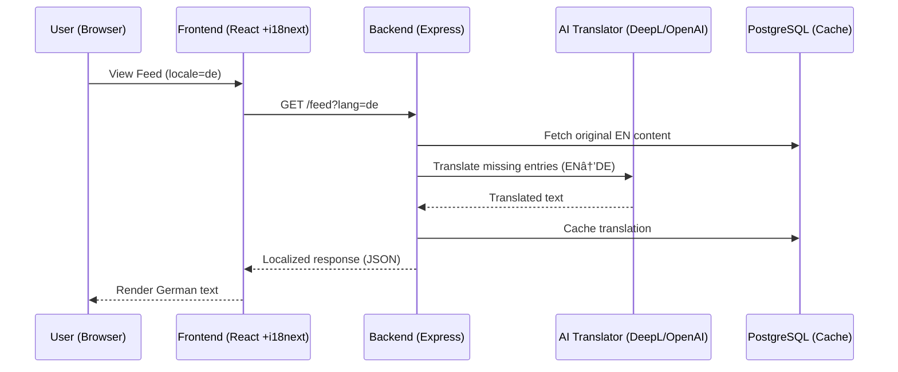

### Backend Modules

- `middlewares/detectLanguage.ts` → reads `Accept-Language` header and sets `req.lang`.  
- `services/translation.service.ts` → handles AI translation + caching.  
- `config/i18n.ts` → defines supported languages and API credentials.  
- Integration into `/feed`, `/sessions`, and `/comments` routers for auto-translated responses.

### Caching Policy
- Key format: `hash(original_text + lang)`  
- Store in `Redis` (or LRU fallback in dev) (Phase 2) or PostgreSQL JSON cache table.  
- TTL: 7 days; re-validate on content edit.

---

## 6.14.3 User Experience Requirements

- **Language Selector:** visible in the navbar; persists selection.  
- **Feedback:** UI must update instantly on language switch without reload.  
- **Accessibility:** `<html lang="xx">` attribute updated dynamically for screen readers.  
- **User-Generated Content:** display translated text with tooltip or toggle to show original.  
- **Consistency:** mixed-language feeds should appear seamless, with auto-translated content visually marked (e.g., “Translated from English”).

---

## 6.14.4 Testing & QA

| Test Type | Objective | Tool |
|------------|------------|------|
| **Unit Tests (Frontend)** | Verify translation tokens render correctly | Jest / React Testing Library |
| **Integration Tests (Backend)** | Validate AI translation API + caching logic | Jest + Supertest |
| **Accessibility Tests** | Ensure language attributes and labels comply with WCAG 2.1 AA | axe-core |
| **Localization Accuracy** | Compare translated outputs via benchmark dataset | Playwright visual regression |
| **Performance Tests** | Ensure caching reduces latency (< 300 ms p95) | k6 |
| **Privacy Audit** | Verify no PII sent to external translators | Security review checklist |

---

## 6.14.5 Roadmap & Future Extensions

| Phase | Focus | Description |
|--------|--------|-------------|
| **Phase 1** | Static EN/DE | JSON dictionaries for all UI tokens |
| **Phase 2** | Hybrid AI translation | Real-time translation of user content + caching |
| **Phase 3** | Multilingual community | Extend to FR/ES; train custom AI glossary for fitness terms |

---

### 6.14.6 Dependencies & Configuration

| Variable | Description | Example |
|-----------|-------------|----------|
| `DEFAULT_LANG` | System fallback language | `en` |
| `AI_TRANSLATION_PROVIDER` | Selected API provider | `OpenAI` |
| `AI_TRANSLATION_KEY` | Provider API key | `env secret` |
| `I18N_SUPPORTED_LANGS` | CSV list of supported locales | `en,de` |

---

### 6.14.7 Security & Compliance

- Translation API calls shall redact usernames, emails, and any identifiers.  
- Translated texts shall be cached only in anonymized form.  
- GDPR compliance: users can request deletion of cached translations linked to their content.  
- Audit logs record all external translation calls with timestamp and target language.

---

### 6.14.8 Success Metrics

| Metric | Target |
|---------|---------|
| Translation coverage (UI) | 100 % of tokens localized |
| Latency for translated feed | ≤ 500 ms p95 |
| AI translation accuracy (manual review) | ≥ 90 % |
| Cache hit ratio | ≥ 80 % |
| User satisfaction with localization (survey) | ≥ 4.5 / 5 |

---

## 7. Data Model and Structures

This section defines the **logical model**, **physical performance features** (indexes, partitioning, materialized views), and **governance rules** (soft deletes, retention). See **Figure 7.1** for the ERD.

---

### 7.1 Logical Overview

- **User & Identity:** `users`, `user_contacts`, `auth_sessions`, `user_state_history`
- **Workout Core:** `exercises`, `sessions`, `session_exercises`, `planned_exercise_attributes`, `actual_exercise_attributes`, `media`
- **Engagement & Social:** `user_points`, `badges`, `followers`
- **Internationalization & Caching:** `translation_cache`
- **Analytics**: `session_summary` (materialized view)

> **Design goals:** 3NF normalization for correctness and GDPR alignment, with selective denormalization via views for performance.

---

### 7.2 ERD

#### 7.2.1 ERD (Mermaid)

```mermaid
erDiagram
    %% ==============================
    %% USERS, SECURITY & IDENTITY
    %% ==============================
    USERS {
        uuid id PK
        string username UNIQUE           %% store as citext or LOWER(username) unique
        string display_name
        string password_hash             %% from conceptual model
        string status                    %% active/suspended/deleted
        string locale                    %% i18n preference
        string preferred_lang            %% alias; optional
        timestamp created_at
        timestamp deleted_at             %% soft delete
        string role_code FK              %% -> ROLES.code
    }

    ROLES {
        string code PK
        string description
    }

    USER_CONTACTS {
        uuid id PK
        uuid user_id FK
        string type                      %% email, phone
        string value UNIQUE
        boolean is_primary
        boolean is_recovery
        boolean is_verified
        timestamp verified_at
        timestamp created_at
    }

    USER_STATIC {
        uuid user_id PK FK
        date date_of_birth
        string gender_code FK            %% -> GENDERS.code
    }

    GENDERS {
        string code PK
        string description
    }

    USER_METRICS {
        uuid id PK
        uuid user_id FK
        decimal weight
        string unit                      %% kg/lb
        string fitness_level_code FK     %% -> FITNESS_LEVELS.code
        string training_frequency        %% e.g., 1-2/wk
        string photo_url
        timestamp recorded_at
    }

    FITNESS_LEVELS {
        string code PK
        string description
    }

    AUTH_SESSIONS {
        uuid jti PK
        uuid user_id FK
        string user_agent
        string ip
        timestamp created_at
        timestamp expires_at
        timestamp revoked_at
    }

    USER_STATE_HISTORY {
        uuid id PK
        uuid user_id FK
        string field                     %% e.g., locale, display_name
        string old_value
        string new_value
        timestamp changed_at
    }

    TRANSLATION_CACHE {
        uuid id PK
        uuid hash UNIQUE                 %% md5(source||lang)::uuid (computed)
        string source
        string lang
        string translated
        timestamp created_at
    }

    %% ==============================
    %% EXERCISES & SESSIONS
    %% ==============================
    EXERCISES {
        uuid id PK
        uuid owner FK                    %% who created it (optional)
        string name
        string type_code FK              %% -> EXERCISE_TYPES.code
        string muscle_group
        string equipment
        jsonb tags                       %% JSONB + GIN
        boolean is_public
        string description_en
        string description_de
        timestamp created_at
        timestamp archived_at
    }

    EXERCISE_TYPES {
        string code PK
        string description
    }

    SESSIONS {
        uuid id PK
        uuid owner_id FK
        uuid plan_id FK
        string title
        timestamp planned_at
        string recurrence_rule
        timestamp started_at
        timestamp completed_at
        string status                    %% planned, in_progress, completed, canceled
        string visibility                %% private/followers/public
        integer calories
        integer points                   %% redundant with USER_POINTS history; optional
        text notes
        timestamp created_at
        timestamp deleted_at
    }

    SESSION_EXERCISES {
        uuid id PK
        uuid session_id FK
        uuid exercise_id FK
        int order_index
        string notes
        timestamp created_at
        timestamp updated_at
    }

    EXERCISE_SETS {
        uuid id PK
        uuid session_exercise_id FK
        int order_index
        int reps
        numeric weight_kg
        int distance_m
        int duration_sec
        int rpe
        string notes
        timestamp created_at
    }

    PLANNED_EXERCISE_ATTRIBUTES {
        uuid id PK
        uuid session_exercise_id FK
        int sets
        int reps
        decimal load
        decimal distance
        interval duration
        int rpe
        interval rest
        jsonb extras
    }

    ACTUAL_EXERCISE_ATTRIBUTES {
        uuid id PK
        uuid session_exercise_id FK
        int sets
        int reps
        decimal load
        decimal distance
        interval duration
        int rpe
        interval rest
        jsonb extras
    }

    %% ==============================
    %% GAMIFICATION & COMMUNITY
    %% ==============================
    USER_POINTS {
        uuid id PK
        uuid user_id FK
        string source_type               %% e.g., workout, streak, challenge
        string algorithm_version
        int points
        timestamp awarded_at
    }

    BADGES {
        uuid id PK
        uuid user_id FK
        string badge_type
        timestamp awarded_at
    }

    FOLLOWERS {
        uuid id PK
        uuid follower_id FK
        uuid following_id FK
        timestamp created_at
    }

    MEDIA {
        uuid id PK
        uuid owner_id FK                 %% uploader
        string target_type               %% 'session'|'exercise'|'profile'|...
        uuid target_id
        string storage_key               %% physical object key
        string file_url                  %% optional public URL
        string mime_type
        string media_type                %% image|video|file (logical)
        int bytes
        timestamp created_at
    }

    %% ==============================
    %% ANALYTICS (DERIVED)
    %% ==============================
    SESSION_SUMMARY {
        uuid session_id PK               %% FK -> sessions.id
        uuid owner_id
        numeric total_volume
        int exercise_count
        string status
        timestamp planned_at
        timestamp completed_at
        timestamp refreshed_at
    }

    %% ==============================
    %% RELATIONSHIPS
    %% ==============================
    USERS ||--o{ USER_CONTACTS : has
    USERS ||--|| USER_STATIC : has
    USERS ||--o{ USER_METRICS : records
    USERS ||--o{ USER_STATE_HISTORY : changes
    USERS ||--o{ AUTH_SESSIONS : maintains
    USERS ||--o{ EXERCISES : owns
    USERS ||--o{ PLANS : owns
    USERS ||--o{ SESSIONS : plans
    USERS ||--o{ USER_POINTS : earns
    USERS ||--o{ BADGES : awarded
    USERS ||--o{ FOLLOWERS : connects
    USERS ||--o{ MEDIA : uploads

    USERS }o--|| ROLES : "has role"
    USER_STATIC }o--|| GENDERS : "has gender"
    USER_METRICS }o--|| FITNESS_LEVELS : "has fitness level"
    EXERCISES }o--|| EXERCISE_TYPES : "has type"

    PLANS ||--o{ SESSIONS : schedules
    SESSIONS ||--o{ SESSION_EXERCISES : includes
    SESSION_EXERCISES ||--o{ EXERCISE_SETS : actuals
    SESSION_EXERCISES ||--o{ PLANNED_EXERCISE_ATTRIBUTES : planned
    SESSION_EXERCISES ||--o{ ACTUAL_EXERCISE_ATTRIBUTES : actual

    SESSIONS ||--o{ SESSION_SUMMARY : summarized_by
```

#### 7.2.2 Key Constraints & Performance Notes

- **Uniqueness & FKs**
  - `USERS.username` unique (use `citext` or `LOWER(username)` index).
  - `FOLLOWERS (follower_id, following_id)` **UNIQUE**; optional check to prevent self-follow.
  - `TRANSLATION_CACHE.hash` **UNIQUE** (computed `md5(source||lang)::uuid`).
  - `USERS.role_code` → `ROLES.code`; `USER_STATIC.gender_code` → `GENDERS.code`; `USER_METRICS.fitness_level_code` → `FITNESS_LEVELS.code`; `EXERCISES.type_code` → `EXERCISE_TYPES.code`.

- **Indexes**
  - `SESSIONS (owner_id, planned_at DESC)`, `(owner_id, status)`; partial on active: `(owner_id) WHERE deleted_at IS NULL`.
  - `SESSION_EXERCISES (session_id, order_index)`.
  - `EXERCISE_SETS (session_exercise_id, order_index)`.
  - `USER_POINTS (user_id, awarded_at DESC)`
  - `PLANS (user_id, status)`; partial `(user_id) WHERE archived_at IS NULL`..
  - `MEDIA (target_type, target_id)`.
  - `EXERCISES.tags` **GIN** index (JSONB).

- **Partitioning**
  - Monthly partitions: `SESSIONS`, `USER_POINTS`, `USER_METRICS` (or `USER_STATE_HISTORY` if preferred).

- **Materialized Views**
  - `SESSION_SUMMARY` refreshed on `session.completed` or nightly; uses `EXERCISE_SETS` to compute volume metrics for dashboards.

- **Security & GDPR**
  - `deleted_at` soft-delete on USERS; analytics/views exclude deleted/archived by default.
  - PII isolated in `USER_STATIC` and `USER_CONTACTS`; audit in `USER_STATE_HISTORY`.

---

#### 7.2.3 Mapping Notes

- **Passwords & Roles:** Keep `password_hash` in `users`; `auth_sessions` for refresh sessions; roles normalized via `roles`.
- **Demographics & Fitness:** `user_static` (DOB, gender) and `user_metrics` (weight, fitness level, frequency, photo) reference lookups.
- **Exercises:** Public or user-owned; tags in `JSONB` with **GIN** index.
- **Sessions:** Rich attributes (title, recurrence, visibility, calories, optional `points` summary).
- **Gamification:** `user_points` stores `source_type` and `algorithm_version`; use history for auditability.
- **Analytics:** `session_summary` for fast dashboard queries.
- **Translation Cache:** Compute-and-store `hash` for deduped lookups.

---

### 7.3 Entities & Key Fields (Data Dictionary)

> Types are PostgreSQL unless noted.

#### `users`
- `id` (uuid, PK), `username` (citext/unique), `display_name`, `locale`, `preferred_lang`, `status`, `role_code` (FK→roles.code), `created_at`, `deleted_at`.

#### `user_contacts`
- `id` (uuid, PK), `user_id` (FK), `type` (email/phone), `value` (unique), `is_primary` (bool), `is_recovery` (bool), `is_verified` (bool), `verified_at`, `created_at`.
- **Index/Constraint:** one primary per user via partial unique `(user_id) WHERE is_primary=true`.

#### `auth_sessions`
- `jti` (uuid, PK), `user_id` (FK), `user_agent`, `ip` (inet), `created_at`, `expires_at`, `revoked_at`.
- **Index:** `(user_id, expires_at)`.

#### `user_state_history`
- `id` (uuid, PK), `user_id` (FK), `field`, `old_value`, `new_value`, `changed_at`.
- **Partitioning:** monthly.

#### `user_metrics`
- `id` (uuid, PK), `user_id` (FK), `weight` (numeric), `unit` (text), `fitness_level_code` (FK→fitness_levels.code), `training_frequency` (text), `photo_url` (text), `recorded_at` (timestamptz).

#### `roles`, `genders`, `fitness_levels`
- `code` (text, PK), `description` (text).

#### `exercises`
- `id` (uuid, PK), `owner` (uuid, FK→users.id, nullable for global), `name` (text), `type_code` (FK→exercise_types.code), `muscle_group` (text), `equipment` (text), `tags` (JSONB), `is_public` (bool), `description_en` (text), `description_de` (text), `created_at`, `archived_at`.
- **Index:** `tags` GIN.

#### `exercise_types`
- `code` (text, PK), `description` (text).

#### `sessions`

#### `plans`
- `id` (uuid, PK), `user_id` (FK→users.id), `name` (text), `status` (text), `progress_percent` (numeric), `session_count` (int), `completed_count` (int), `start_date` (date), `end_date` (date), `created_at`, `updated_at`, `archived_at`.
- **Index:** `(user_id, status)`; partial `(user_id) WHERE archived_at IS NULL`.

- `id` (uuid, PK), `owner_id` (FK→users.id), `plan_id` (FK→plans.id, nullable), `title` (text), `planned_at` (timestamptz), `recurrence_rule` (text), `started_at`, `completed_at`, `status` (text), `visibility` (text), `calories` (int), `points` (int, optional summary), `notes` (text), `created_at`, `deleted_at`.
- **Indexes:** `(owner_id, planned_at DESC)`, `(owner_id, status)`, partial `(owner_id) WHERE deleted_at IS NULL`.
- **Partitioning:** monthly.

#### `session_exercises`
- `id` (uuid, PK), `session_id` (FK), `exercise_id` (FK), `order_index` (int), `notes` (text), `created_at`, `updated_at`.
- **Index:** `(session_id, order_index)`.
- **Constraint:** `UNIQUE (session_id, order_index)`.

#### `exercise_sets`
- `id` (uuid, PK), `session_exercise_id` (FK), `order_index` (int), `reps` (int), `weight_kg` (numeric), `distance_m` (int), `duration_sec` (int), `rpe` (int), `notes` (text), `created_at`.
- **Index:** `(session_exercise_id, order_index)`.
- **Constraint:** `UNIQUE (session_exercise_id, order_index)`.

#### `planned_exercise_attributes`
- `id` (uuid, PK), `session_exercise_id` (FK), `sets` (int), `reps` (int), `load` (numeric), `distance` (numeric), `duration` (interval), `rpe` (int), `rest` (interval), `extras` (JSONB).

#### `actual_exercise_attributes`
- `id` (uuid, PK), `session_exercise_id` (FK), `sets` (int), `reps` (int), `load` (numeric), `distance` (numeric), `duration` (interval), `rpe` (int), `rest` (interval), `extras` (JSONB).

#### `user_points`
- `id` (uuid, PK), `user_id` (FK), `source_type` (text), `algorithm_version` (text), `points` (int), `awarded_at` (timestamptz).
- **Index:** `(user_id, awarded_at DESC)`.
- **Partitioning:** monthly.

#### `badges`
- `id` (uuid, PK), `user_id` (FK), `badge_type` (text), `awarded_at` (timestamptz).

#### `followers`
- `id` (uuid, PK), `follower_id` (FK→users.id), `following_id` (FK→users.id), `created_at` (timestamptz).
- **Constraint:** `UNIQUE (follower_id, following_id)`; optional CHECK `follower_id <> following_id`.

#### `media`
- `id` (uuid, PK), `owner_id` (FK→users.id), `target_type` (text), `target_id` (uuid), `storage_key` (text), `file_url` (text), `mime_type` (text), `media_type` (text), `bytes` (int), `created_at` (timestamptz).
- **Index:** `(target_type, target_id)`.

#### `translation_cache`
- `id` (uuid, PK), `hash` (uuid, **UNIQUE**, computed `md5(source||lang)::uuid`), `source` (text), `lang` (text), `translated` (text), `created_at`.

#### `session_summary` *(materialized view)*
- `session_id` (uuid, PK=FK→sessions.id), `owner_id` (uuid), `total_volume` (numeric), `exercise_count` (int), `status` (text), `planned_at`, `completed_at`, `refreshed_at`.
- **Refresh:** on `session.completed` event or nightly (data sourced from `exercise_sets`).

---

## 7.4 Foreign Keys & Cascades

- **Users → Sessions / Exercises / Points / Followers / Media:** `ON DELETE RESTRICT` (GDPR: prefer anonymization over cascade).
- **Sessions → Session Exercises → Attributes:** `ON DELETE CASCADE` to keep child rows consistent.
- **Media (polymorphic):** Application level enforcement; DB constraint via `(target_type, target_id)` references is emulated with triggers if required.

---

## 7.5 Indexing Strategy (Summary)

- **Lookup:** `users(LOWER(username))`, `auth_sessions(user_id, expires_at)`, `media(target_type, target_id)`.
- **Timeline:** `sessions(owner_id, planned_at DESC)`, `user_points(user_id, awarded_at DESC)`.
- **Active only:** Partial indexes `WHERE deleted_at IS NULL` on `sessions`; `WHERE archived_at IS NULL` on `exercises`.
- **Search:** **GIN** index on `exercises.tags` (JSONB).
- **Uniqueness:** `followers(follower_id, following_id)`, `translation_cache(hash)`.

---

## 7.6 Partitioning & Retention

- **Monthly partitions:** `sessions`, `user_points`, `user_state_history`.
- **Retention policy:** Archived/soft deleted rows excluded from defaults; Deletion propagation across primaries/backups **≤14 days**; account hard-delete **≤30 days**; export links valid **24h**. (see §5.2, §5.7).

---

## 7.7 Materialized Views & Denormalization

- **`session_summary`**: reduces heavy joins for dashboards. 
- Create with `WITH NO DATA`; 
- **`REFRESH CONCURRENTLY`** after initial backfill; 
- refresh in off peak windows.

---

## 7.8 Migration Notes (DDL Highlights)

> Canonical home for DDL snippets. All earlier duplicate DDL content is removed to avoid drift.

```sql
-- Followers unique
ALTER TABLE followers
  ADD CONSTRAINT followers_unique UNIQUE (follower_id, following_id);

-- Exercises tags JSONB + GIN
ALTER TABLE exercises
  ALTER COLUMN tags TYPE jsonb USING to_jsonb(tags);
CREATE INDEX idx_exercises_tags_gin ON exercises USING GIN (tags);

-- Translation cache hash
ALTER TABLE translation_cache
  ADD COLUMN hash uuid GENERATED ALWAYS AS ((md5(source || lang))::uuid) STORED,
  ADD CONSTRAINT translation_cache_hash_unique UNIQUE (hash);

-- Sessions owner/status/planned_at + partial active
CREATE INDEX idx_sessions_owner_planned ON sessions(owner_id, planned_at DESC);
CREATE INDEX idx_sessions_owner_status ON sessions(owner_id, status);
CREATE INDEX idx_sessions_owner_active ON sessions(owner_id) WHERE deleted_at IS NULL;

-- Session exercises ordering
CREATE INDEX idx_session_exercises_order ON session_exercises(session_id, order_index);
```

---

### 7.9 Compliance Note
All new physical changes (indexes, partitions, views) are **non-breaking** (backwards-compatible); they do not alter API contracts and are compatible with existing migrations.

---

### 7.10 Lookup Normalization Tables

To improve referential integrity and analytics, the following lookup tables shall replace plain-text enums:

| Table | Example Values |
|--------|----------------|
| **contact_types** | email, phone |
| **training_freq** | none, monthly, weekly, daily |
| **point_sources** | session_completion, admin_adjustment, bonus_event |
| **badge_types** | first_session, hundred_workouts, marathon_badge |

Each shall use `code TEXT PRIMARY KEY` and a localized `description TEXT` column.

---

## 8. User Experience (UX)

### 8.1 Key Screens

1. **Login / Registration**

   - **Purpose:** Secure access to the platform.
   - **Features:**
     - Login with username/password.
     - Registration with email verification.
     - Password reset with 15-minute TTL token.
     - Optional 2FA (TOTP + backup codes).
   - **Design Notes:**
     - Minimal form fields; clear validation messages.
     - Prominent CTA buttons (“Login”, “Register”).
     - Accessibility: focus order, error messages with ARIA labels, keyboard-navigable.

2. **Dashboard / Homepage**

   - **Purpose:** First point of interaction after login; quick overview.
   - **Features:**
     - “Next planned session” card.
     - Quick stats: streak, weekly volume, points.
     - Feed preview of recent public sessions.
   - **Design Notes:**
     - Card-based layout with minimal icons (Lucide).
     - Color semantics: green for completed, indigo/purple gradient for planned.
     - Accessibility: high-contrast palette, scalable typography, responsive grid.

3. **Planner**

   - **Purpose:** Plan sessions in advance, including recurring schedules.
   - **Features:**
     - Calendar view (week/month).
     - Create/edit session with exercises.
     - Recurrence rules (weekly, custom).
   - **Design Notes:**
     - Drag-and-drop exercise selection.
     - Tooltips with planned attributes (sets, reps, load, RPE).
     - Accessibility: calendar keyboard navigation, ARIA labels for events.

4. **Logger**

   - **Purpose:** Record actual session performance.
   - **Features:**
     - Mark session as completed or canceled.
     - Capture actual sets/reps/load/duration.
     - Compare planned vs actual in real-time.
   - **Design Notes:**
     - Mobile-first form (stepper for reps/sets).
     - Inline progress indicators (completion %).
     - Accessibility: large touch targets, validation feedback announced to screen readers.

5. **Progress Dashboard**

   - **Purpose:** Track performance and visualize progress.
   - **Features:**
     - Charts: volume, duration, distance, intensity, frequency.
     - Filters: date, category, visibility.
     - Personal bests and streaks.
   - **Design Notes:**
     - Recharts for interactive graphs.
     - Export options (CSV, JSON).
     - Accessibility: color-blind friendly charts; text summaries of metrics.

6. **Feed / Community**

   - **Purpose:** Engage with public content, discover new sessions.
   - **Features:**
     - Paginated list of public sessions.
     - Clone sessions with attribution.
     - Report inappropriate content (future admin moderation).
   - **Design Notes:**
     - Infinite scroll or paginated grid.
     - Default privacy = private; visual markers for public sessions.
     - Accessibility: distinguishable session cards with ARIA region labeling.

7. **Profile & Settings**
   - **Purpose:** Manage account details, privacy, and security.
   - **Features:**
     - Profile editing (alias, avatar, fitness level, frequency).
     - Security settings (password, 2FA, data export, account deletion).
     - Privacy controls (session visibility defaults).
   - **Design Notes:**
     - Tabbed interface for Profile / Security / Privacy.
     - Avatar upload with 128×128 preview.
     - Accessibility: forms labeled, destructive actions require confirmation modal.

### 8.2 UX Design Principles

- **Minimalist & Consistent:** Clear hierarchy, reusable components, responsive design.
- **Accessibility:** WCAG 2.1 AA conformance; ARIA roles; keyboard navigation.
- **Privacy-first:** Defaults to private; opt-in for sharing and analytics.
- **Gamified Engagement:** Subtle points and streak indicators encourage continued use.
- **Future-proof:** Layout accommodates additional modules (nutrition, leaderboards, wearables).

### 8.3 User Journeys

The graphs show the user's journey over the app screens and the expected satisfaction from the interaction with FitVibe.

- Registration flow shown in **Figure 8.1**.
- Plan and log flow shown in **Figure 8.2**.
- Session discovery and cloning shown in **Figure 8.3**.
- Profile update and archival with errors shown in **Figure 8.4**.
- Profile update and archival flow shown in **Figure 8.5**.

#### Registration → Account Activation

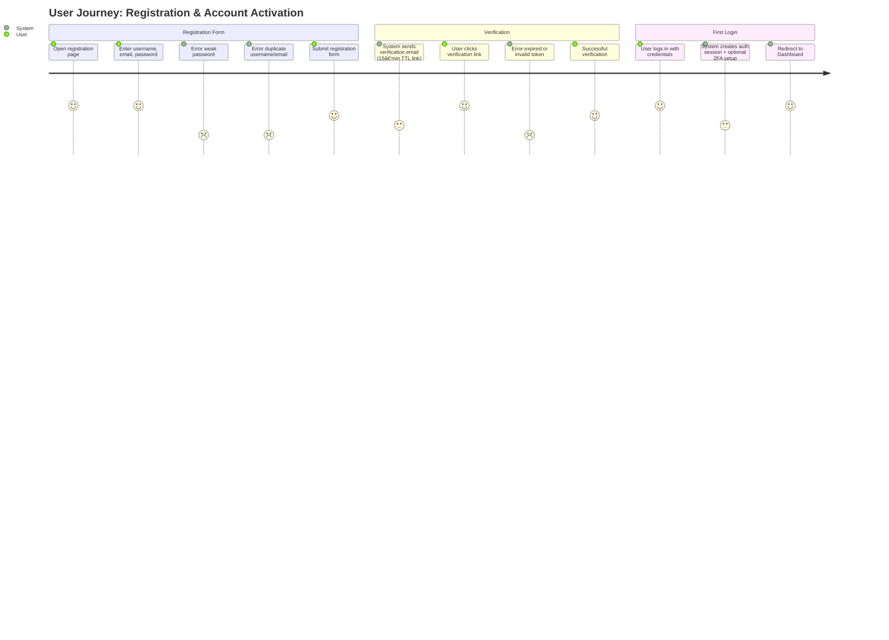

#### Login → Dashboard → Planner → Logger → Progress

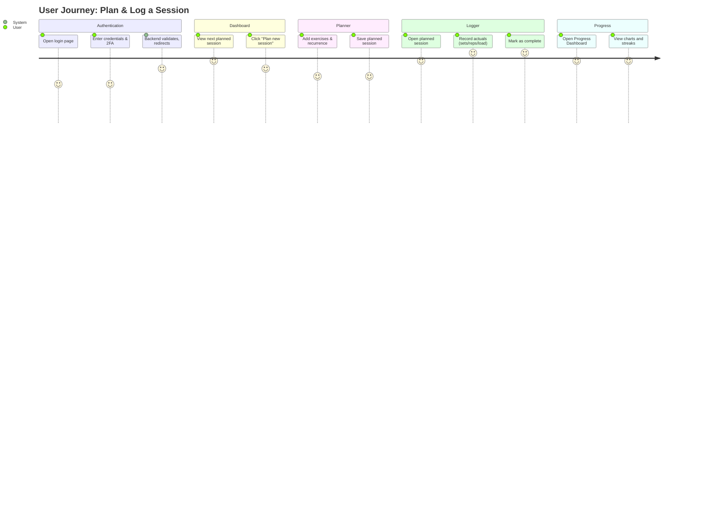

#### Dashboard → Feed → Clone Session

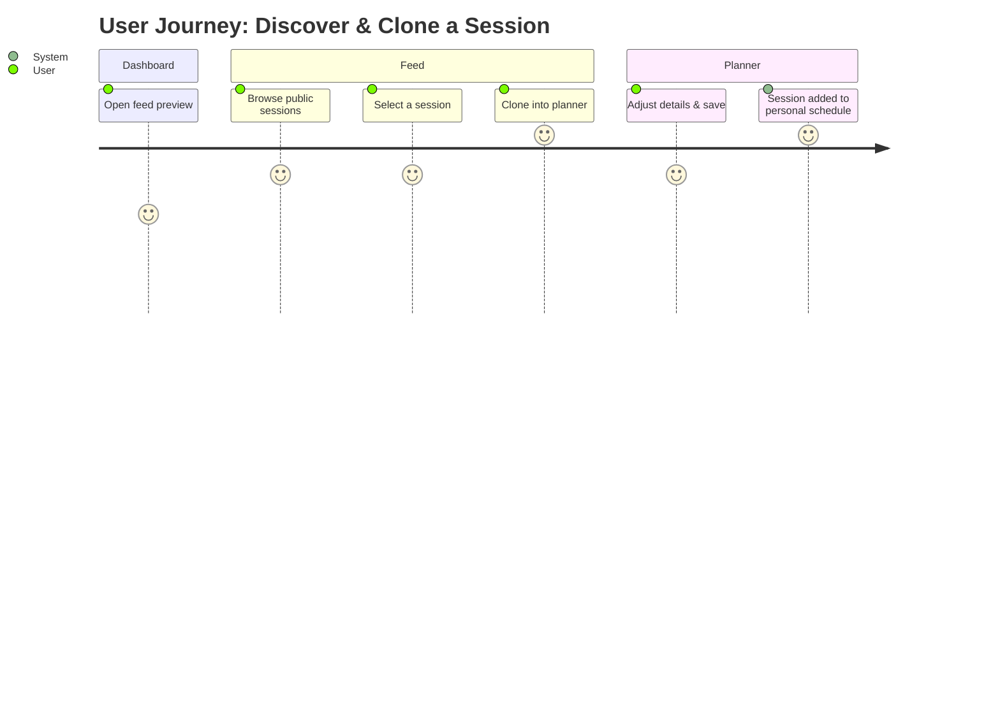

#### Profile → Change State (Update Info or Archive Account) with Error States

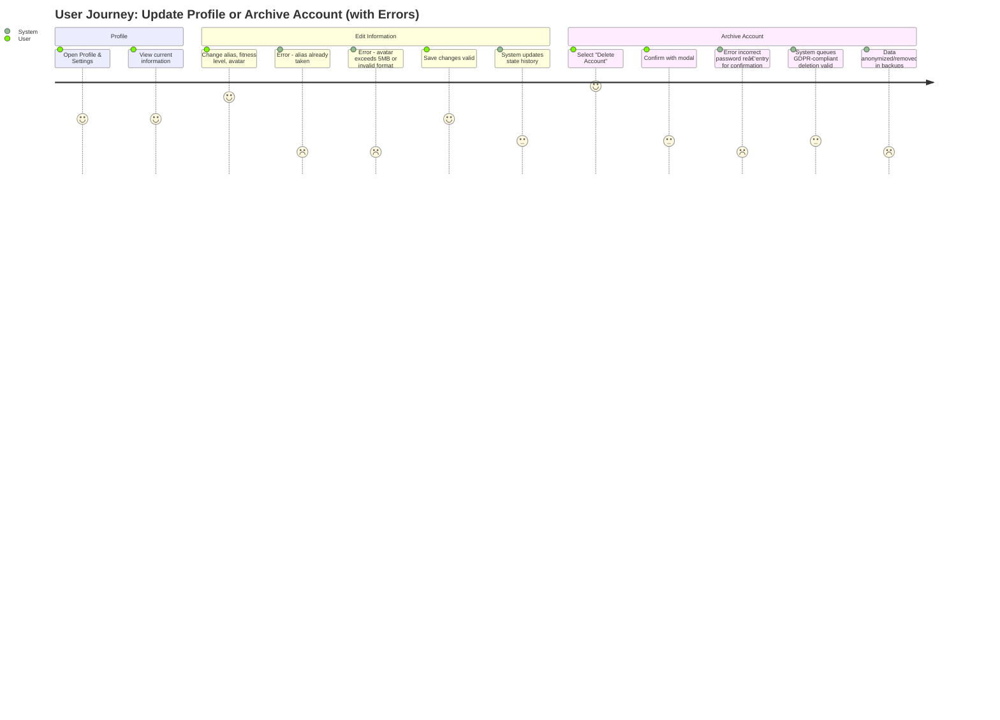

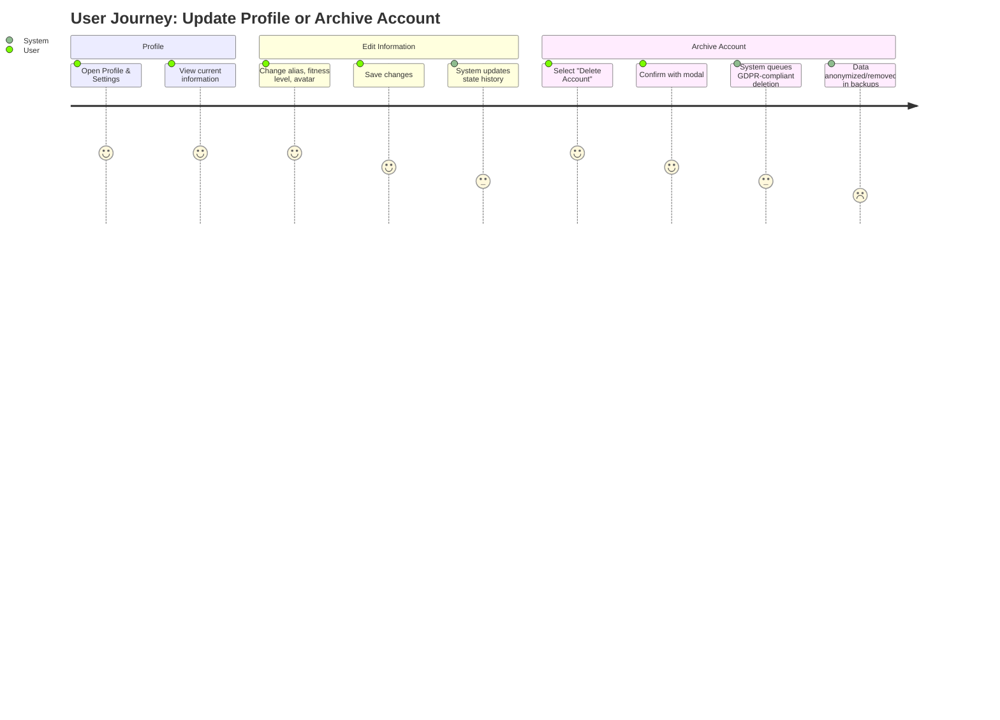

---

### 8.4 Visual Design System

This section defines the **FitVibe color palette**, **visual identity**, and **UI component principles** derived from the current design explorations and logo branding.

#### 8.4.1 Design Philosophy

FitVibe’s interface expresses **energy, discipline, and balance** through a harmonious blend of the four classical elements—**Fire**, **Water**, **Earth**, and **Air**—which mirror the app’s fitness domains (speed, endurance, strength, agility).  
The tone is **minimalist**, **professional**, and **accessible**, aligning with WCAG 2.1 AA standards.

---

#### 8.4.2 Brand Color System (v1.0)

| Element           | Role                 | Highlight | Base      | Shadow    | Usage                                       |
| ----------------- | -------------------- | --------- | --------- | --------- | ------------------------------------------- |
| **Fire**          | Speed & Intensity    | `#FDC54D` | `#F9A51A` | `#B45E00` | Primary buttons, CTAs, hover emphasis       |
| **Water**         | Flow & Endurance     | `#5CB2F5` | `#1A78DA` | `#0E4E95` | Progress bars, charts, secondary actions    |
| **Earth**         | Strength & Stability | `#4D7C62` | `#29553E` | `#162C22` | Navigation bars, confirmations, footers     |
| **Air**           | Agility & Clarity    | `#FFE8A3` | `#F9E6B2` | `#CBB56C` | Highlights, tooltips, secondary backgrounds |
| **Neutral Light** | —                    | —         | `#FAF9F6` | —         | Primary surface color (light mode)          |
| **Neutral Dark**  | —                    | —         | `#0B0C10` | —         | Background & text color (dark mode)         |

**Gradients**

- **Fire → Air** → `linear-gradient(90deg, #F9A51A, #FFE8A3)`
- **Water → Earth** → `linear-gradient(90deg, #1A78DA, #29553E)`
- **Four-Element Blend** → `linear-gradient(270deg, #F9A51A, #1A78DA, #29553E, #FFE8A3)`

---

#### 8.4.3 Depth and Shadow System

| Level    | Purpose                          | Example                  |
| -------- | -------------------------------- | ------------------------ |
| Shadow-1 | Subtle UI depth (buttons, icons) | `rgba(11, 12, 16, 0.10)` |
| Shadow-2 | Card and modal elevation         | `rgba(11, 12, 16, 0.20)` |
| Shadow-3 | Floating elements                | `rgba(11, 12, 16, 0.30)` |

---

#### 8.4.4 Light / Dark Mode Specification

- **Light Mode**

  - Background: `#FAF9F6`
  - Text: `#1C1C1C`
  - Emphasis colors follow Fire & Earth tones for warmth and stability.
  - Cards use soft shadows and warm whites to ensure legibility.

- **Dark Mode**
  - Background: `#0B0C10`
  - Text: `#E3E0D9`
  - Gradients become deeper; contrasts shift toward Water & Fire hues for vibrancy.
  - Shadows replaced with soft glow or brightness layering.

---

#### 8.4.5 Component Style Tokens

| Component            | Background                           | Text                  | Border / Accent | Hover / Active                   |
| -------------------- | ------------------------------------ | --------------------- | --------------- | -------------------------------- |
| **Navbar**           | `#29553E` (light) / `#162C22` (dark) | `#FAF9F6`             | —               | Gradient overlay (Earth → Water) |
| **Primary Button**   | `#F9A51A`                            | `#0B0C10`             | none            | `#FDC54D`                        |
| **Secondary Button** | `#1A78DA`                            | `#FAF9F6`             | none            | `#5CB2F5`                        |
| **Card**             | `#FFFFFF` (light) / `#162C22` (dark) | `#1C1C1C` / `#E3E0D9` | `#E3E0D9`       | Border accent → `#F9A51A`        |
| **Footer**           | `#29553E` (light) / `#0B0C10` (dark) | `#FAF9F6`             | —               | none                             |

---

#### 8.4.6 Logo and Brand Symbolism

- **Primary Logo:** circular emblem composed of four flowing wave-segments (Fire, Water, Earth, Air) encased in a dark-navy outline.
- **Monochrome Logo:** white emblem on dark background for minimal contexts.
- **Favicon:** simplified emblem without typography.
- **Typography:** Sans-serif, geometric font (e.g., _Inter_, _Nunito Sans_, _Poppins_).
- **Iconography:** line-based (Lucide React) for visual consistency.

#### 8.4.6.1 Branding

- **Catchphrase**: FitVibe: Your vibe, your fitness

---

#### 8.4.7 Typography System

The typography for **FitVibe** conveys **clarity, precision, and professionalism**.  
It avoids decorative styles in favor of a **neutral, functional aesthetic** that supports readability across training dashboards, mobile interfaces, and data-dense components.

##### 8.4.7.1 Design Principles

- **Modern & Neutral:** Typography is clean and understated — focused on legibility, not personality.
- **Consistency:** Heading weights and spacing follow a unified rhythm; the same styles apply across all devices.
- **Function over style:** Size and spacing create hierarchy rather than color or ornament.
- **Performance:** System-rendered fonts reduce load time and maintain crispness on all screens.
- **Accessibility:** Conforms to WCAG 2.1 AA for size and contrast; supports text scaling to 200 %.

---

##### 8.4.7.2 Typefaces

| Role                    | Font Family                  | Fallback                                  | Description                                                                                                               |
| ----------------------- | ---------------------------- | ----------------------------------------- | ------------------------------------------------------------------------------------------------------------------------- |
| **Primary Typeface**    | **Roboto Flex** _(Variable)_ | `system-ui, Helvetica, Arial, sans-serif` | A modern, highly legible neo-grotesque designed for digital UI. Variable axes allow fine weight and optical-size control. |
| **Secondary Typeface**  | **Inter**                    | `system-ui, Helvetica, sans-serif`        | Used for longer paragraphs and UI text where optimal legibility and compact spacing are needed.                           |
| **Monospace / Numeric** | **IBM Plex Mono**            | `monospace`                               | Used in analytics panels and numeric outputs for alignment precision.                                                     |

All typefaces are open-source and screen-optimized.  
If system fonts are used for performance, **SF Pro Display (macOS/iOS)** and **Segoe UI Variable (Windows 11)** are the preferred fallbacks.

---

##### 8.4.7.3 Typographic Scale

| Level        | Role                       | Weight        | Size (rem) | Line Height | Notes                                    |
| ------------ | -------------------------- | ------------- | ---------- | ----------- | ---------------------------------------- |
| H1           | Page title / Hero headline | 600           | 3.0        | 1.2         | Clear, confident section openers.        |
| H2           | Section heading            | 600           | 2.0        | 1.3         | Used for major content groupings.        |
| H3           | Subsection / Card title    | 500           | 1.5        | 1.35        | Consistent across cards and widgets.     |
| Body Text    | Paragraph / description    | 400           | 1.125      | 1.6         | Default text size for all content.       |
| Caption      | Metadata / labels          | 400 italic    | 0.875      | 1.4         | Used for timestamps, footnotes.          |
| Button Label | Actions / CTAs             | 600 uppercase | 1.0        | 1.2         | Compact, assertive call-to-action style. |

All sizes use fluid scaling with `clamp()` to adapt between mobile and desktop viewports.

---

##### 8.4.7.4 Implementation Guidelines

```css
@import url("https://fonts.googleapis.com/css2?family=Roboto+Flex:wght@400;500;600&family=Inter:wght@400;500&display=swap");

html {
  font-family: "Roboto Flex", "Inter", system-ui, sans-serif;
  font-synthesis: none;
  -webkit-font-smoothing: antialiased;
  text-rendering: optimizeLegibility;
}

h1,
h2,
h3 {
  font-weight: 600;
  letter-spacing: -0.01em;
  color: #111;
}

p {
  max-width: 70ch;
  color: #333;
  line-height: 1.6;
}
```

---

#### 8.4.8 Accessibility & Contrast

- All text-to-background contrast ratios ≥ 4.5 : 1 (WCAG 2.1 AA).
- Color-blind-safe palette verified for deuteranopia and protanopia.
- Hover and focus states rely on both **color** and **shadow/glow** cues.
- Maintain a **maximum line length of 65–75 characters** for body text.
- Avoid all-caps in large blocks of text.
- Preserve at least **1.4 em vertical spacing** between paragraphs.
- Headings and UI labels must maintain **≥ 4.5 : 1** color contrast ratio.
- Typography is validated for clarity on **Retina / 4K** and **OLED** displays.

---

## 9. Authentication Lifecycle

Authentication in **FitVibe** follows a **security-first, token-based model** with strict session management, GDPR compliance, and extensibility for future identity providers.

The authentication lifecycle is depicted in **Figure 9.1**.  
Risks and mitigations are summarized in **Table 9.1**.

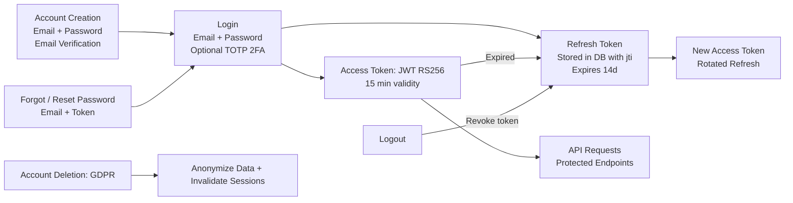

### 9.1 Account Creation

- **Registration Flow:**
  - User provides email + password.
  - Email verification required (activation link, expires in 24h).
- **Password Policy:**
  - Minimum 12 characters, at least one uppercase, one lowercase, one digit, one special character.
  - No birthday and user name
  - Stored using **bcryptjs** with unique per-user salt.
- **Account Confirmation:**
  - Account remains inactive until verified.
  - Verification email sent via provider-agnostic mailer (SMTP/SES/SendGrid).
  - One account per email allowed.

### 9.2 Login

- **Primary login:** email + password.
- **Session security:**
  - Passwords checked with bcryptjs hash.
  - Upon success, issue:
    - **Access token (JWT, RS256)** → short-lived (15 min).
    - **Refresh token** → server-stored, tied to user ID + `jti`.
  - Both tokens returned via **httpOnly, Secure cookies**.
- **Optional MFA (Phase 2+):**
  - TOTP 2FA (RFC 6238, Google Authenticator/FreeOTP).
  - Backup codes (one-time, printable).

### 9.3 Session Management

- **Access Token:**
  - JWT signed with RS256.
  - Contains minimal claims (user ID, scope, expiration).
  - Lifetime: ≤15 minutes.
- **Refresh Token:**
  - Stored server-side in DB with `jti` (rotation ID).
  - Rotated on every use; old tokens revoked.
  - Stored in `httpOnly Secure` cookies with `SameSite=Lax`.
- **Auto-Refresh:**
  - Axios interceptor retries requests on 401 → `/auth/refresh`.
- **Session Expiration:**
  - Refresh token lifetime configurable (e.g., 14 days).
  - Expired sessions require full login.
- **Audit & Anomaly Detection:** 
  - Audit-log login/refresh/logout with timestamp/IP; 
  - Trigger step-up auth on device anomalies.

### 9.4 Logout

- **Single-session logout:**
  - Refresh token revoked from DB.
  - Cookies cleared on client.
- **Global logout:**
  - All refresh tokens revoked for that user (`WHERE user_id = ?`).
  - Useful for compromised account recovery.

### 9.5 Password Management

- **Change password:**
  - Requires current password.
  - No reuse of passwords.
  - Triggers forced re-login (all tokens invalidated).
- **Forgot password:**
  - Email with one-time token (expires in 15 minutes).
  - Token linked to `reset_requests` table in DB.
- **Password reset:**
  - Sets new password, invalidates all existing sessions.
- **Reset Flow Hardening:** 
  - One-time tokens (≤15 min) invalidated upon first use; 
  - Successful resets revoke all sessions and capture a device fingerprint.

### 9.6 Token & Key Management

- **JWT Access Tokens:**
  - Signed with private key (RS256).
  - Public key exposed at `/.well-known/jwks.json` multi-key rotation supported.
- **Key Rotation:**
  - Private keys rotated annually (at minimum).
  - Old keys supported for a grace period (multi-key validation).
- **Refresh Token DB:**
  - Columns: `id`, `user_id`, `jti`, `expires_at`, `revoked_at`.
  - Indexes: `(user_id, jti)` for fast lookup.

### 9.7 Account Recovery & Deletion

- **Account Recovery:**
  - Verified email reset flow.
  - Locked after multiple failed attempts (rate-limited).
- **Account Deletion (GDPR):**
  - User can request account deletion → triggers anonymization.
  - Retention exceptions for audit/logging (non-identifiable).
- **Data Export:**
  - DSR endpoint for user data export (JSON, machine-readable).

### 9.8 Future Extensions (Phase 2+)

- **Social Login / OAuth 2.0:** Google, Apple, GitHub.
- **Role-based Access Control (RBAC):** Differentiated roles (user, admin, moderator).
- **Device Trust:** Recognized device tokens, with step-up auth for new devices.
- **Session Analytics:** Alerts for unusual login activity (geo/IP anomaly).

---

## 10. Backlog Items

### 10.1 Backend Backlog

- Admin moderation (report queue, suspensions, takedowns).
- Notifications (email/push, job queue).
- Wearables integration (Garmin/Strava).
- Nutrition module (meals, macros).
- AI recommendations (adaptive training).
- Leaderboards (global/friends).

### 10.2 Frontend Backlog

- Advanced dashboards (PBs, streaks).
- Social features (likes, bookmarks, comments).
- Follow users (follow/unfollow UI, follower counts)
- Leaderboards (global/friends)
- Badges surfacing.
- Notifications UI.
- Extended feed features.

---

## 11. Project Structure

The repository layout is provided, CI/CD workflow illustrated in **Figure 11.1**.

The **FitVibe** system is organized as a **monorepo** using **pnpm workspaces** and optional **Turborepo** task caching. This approach ensures:

- **Separation of concerns** between frontend, backend, shared libraries, and infrastructure.
- **Consistency** in tooling (TypeScript, ESLint, Prettier) across all modules.
- **Scalability**, as new features (e.g., nutrition, wearables, AI modules) can be added without breaking existing functionality.
- **Traceability**, with version-controlled documentation, migrations, and infrastructure as code.

The structure reflects a clear distinction between **applications**, **shared packages**, and **infrastructure**:

```
fitvibe/
├── tests/
│   ├── setup/
│   │   ├── jest.setup.ts        # DB + env bootstrap
│   │   └── test-helpers.ts      # shared utils
│   ├── db/
│   │   └── sanity.test.ts       # DB sanity check
│   ├── api/
│   │   ├── auth.test.ts
│   │   ├── users.test.ts
│   │   └── sessions.test.ts
│   └── frontend/
│       └── components.test.ts   # optional in Phase 2
├── apps/
│   ├── frontend/
│   │   ├── public/
│   │   │   ├── favicon.ico
│   │   │   ├── index.html
│   │   │   └── robots.txt
│   │   ├── src/
│   │   │   ├── assets/.gitkeep
│   │   │   ├── components/
│   │   │   │   └── README.md            # describe UI primitives
│   │   │   ├── features/
│   │   │   │   └── README.md            # Planner, Logger, Progress, Feed, Profile
│   │   │   ├── hooks/
│   │   │   │   └── useAuth.ts           # stub hook
│   │   │   ├── pages/
│   │   │   │   ├── Dashboard.tsx
│   │   │   │   └── Profile.tsx
│   │   │   ├── router/
│   │   │   │   └── index.tsx            # React Router placeholder
│   │   │   ├── state/
│   │   │   │   └── auth.store.ts        # Zustand/Redux stub
│   │   │   ├── styles/
│   │   │   │   └── globals.css
│   │   │   ├── utils/
│   │   │   │   └── i18n.ts              # EN/DE placeholder
│   │   │   ├── main.tsx
│   │   │   └── index.html
│   │   ├── vite.config.ts
│   │   ├── tailwind.config.ts
│   │   └── tsconfig.json
│   │
│   ├── backend/
│   │   ├── src/
│   │   │   ├── api/
│   │   │   │   ├── health/health.router.ts      # system health check (non-functional)
│   │   │   │   ├── auth/auth.router.ts
│   │   │   │   ├── users/users.router.ts
│   │   │   │   ├── exercises/exercises.router.ts
│   │   │   │   ├── sessions/sessions.router.ts
│   │   │   │   ├── progress/progress.router.ts
│   │   │   │   ├── points/points.router.ts
│   │   │   │   └── feed/feed.router.ts
│   │   │   ├── config/env.ts            # zod validated env
│   │   │   ├── db/
│   │   │   │   ├── migrations/.gitkeep
│   │   │   │   ├── seeds/.gitkeep
│   │   │   │   └── knexfile.ts
│   │   │   ├── jobs/.gitkeep            # BullMQ/Temporal (future)
│   │   │   ├── middlewares/
│   │   │   │   └── errorHandler.ts
│   │   │   ├── models/.gitkeep
│   │   │   ├── services/
│   │   │   │   └── mailer.service.ts    # stub mailer abstraction
│   │   │   ├── utils/logger.ts
│   │   │   ├── app.ts                   # express bootstrap
│   │   │   └── server.ts                # server entrypoint
│   │   ├── tsconfig.json
│   │   └── package.json
│   │
│   └── docs/
│       ├── prd.md                       # product requirements
│       ├── architecture.mmd             # mermaid: HLA
│       ├── erd.mmd                      # mermaid: DB schema
│       └── auth-lifecycle.mmd           # mermaid: auth flow
│
├── packages/
│   ├── eslint-config/
│   │   └── index.js
│   ├── tsconfig/
│   │   └── tsconfig.base.json
│   ├── ui/
│   │   ├── Button.tsx
│   │   └── README.md
│   ├── utils/
│   │   ├── dates.ts
│   │   └── README.md
│   └── types/
│       └── index.ts                     # shared TS types (User, Session, Exercise)
│
├── infra/
│   ├── docker/
│   │   ├── Dockerfile.frontend
│   │   ├── Dockerfile.backend
│   │   ├── docker-compose.dev.yml
│   │   ├── docker-compose.prod.yml
│   │   └── nginx.conf
│   ├── github/
│   │   └── workflows/
│   │       ├── ci.yml
│   │       └── cd.yml
│   └── scripts/
│       ├── seed-dev.sh
│       ├── migrate.sh
│       └── rollback.sh
│
├── .gitignore
├── .dockerignore
├── .eslintrc.js
├── .prettierrc
├── pnpm-workspace.yaml
├── turbo.json
├── tsconfig.base.json
├── jest.config.ts
└── package.json
```

---

### 11.1 Rationale

- **Monorepo Management**:

  - `pnpm` ensures efficient dependency management and disk space savings.
  - `turborepo` enables task caching, speeding up builds and tests across apps.

- **Strict Separation**:

  - **apps/** contains deployable code (frontend, backend, docs).
  - **packages/** holds reusable libraries (UI, utils, types) to avoid duplication.
  - **infra/** centralizes deployment, CI/CD, and operational scripts.

- **Developer Experience**:

  - Shared **TypeScript configs** and **linting rules** guarantee consistency.
  - Local development supports hot reloads with seeded demo data.
  - Documentation is versioned alongside source code (`apps/docs/`).

- **Extensibility**:
  - New domains (nutrition, AI coaching, wearables) can be introduced as new routers in `apps/backend/src/api` and features in `apps/frontend/src/features`.
  - Shared entities (`packages/types`) evolve without breaking existing modules.

> **Repository hygiene**: Uploads and other generated artifacts are intentionally **excluded** from VCS and Docker build contexts via `.gitignore` and `.dockerignore` to support GDPR and reduce image bloat.

---

### 11.2 CI/CD Workflow

To ensure **consistent collaboration, predictable deployments, and safe rollbacks**, the following CI/CD workflow applies. The CI/CD pipeline implements a **DevSecOps-first strategy** to ensure software integrity, schema consistency, and operational resilience.


```mermaid
flowchart TD
  Dev[Developer] -->|push/PR| Repo[GitHub Repository]

  subgraph CI[Continuous Integration]
    direction TB
    Repo --> Checkout[Checkout Code]
    Checkout --> Install[Install Dependencies + Restore Cache]
    Install --> Lint[Run Lint]
    Lint --> TypeCheck[Run Type Check]
    TypeCheck --> Test[Jest: Run Unit & Integration Tests]
    Test --> Build[Build FE & BE Artifacts]
    Build --> DockerBuild[Build Docker Images]
    DockerBuild --> SecScans[Snyk + Trivy/Grype + Secret Scan]
    SecScans --> SignSBOM[Cosign Sign + SBOM]
    SignSBOM --> PushImages[Push to GHCR: SHA + SemVer + Digest]
    Lint -.->|fail| CI_Fail[❌ CI Failed]
    TypeCheck -.->|fail| CI_Fail
    Test -.->|fail| CI_Fail
    SecScans -.->|high severity| CI_Fail
  end

  PushImages --> Approval[🔒 Manual Approval Required]

  subgraph CD[Continuous Deployment]
    direction TB
    Approval --> Deploy[Deploy Job]
    Deploy --> Runner[GitHub Runner / SSH to Host]
    Runner --> Pull[Pull Signed Digests from GHCR]
    Pull --> BlueGreen[Blue‑Green / Rolling Strategy]
    BlueGreen --> Compose[Run docker compose prod]
    Compose --> DBMigrate[Apply Knex Migrations]
    DBMigrate --> DBTasks[Refresh Materialized Views + Rotate Partitions]
    DBTasks --> HealthCheck[Run Health Checks]
    HealthCheck -->|ok| Services[✅ Services Updated]
    HealthCheck -.->|fail| Rollback[Rollback to Previous Image]
    Services --> PostOps[Vault Rotation + Metrics + Alerts]
  end
```

---

## 11.2.1 Local Development  ✅ *(baseline preserved)*

- **Clone & Install**
  ```bash
  git clone <repo-url>
  cd fitvibe
  pnpm install
  ```

- **Run Applications**
  ```bash
  # frontend (Vite + React)
  pnpm --filter frontend dev

  # backend (Express API)
  pnpm --filter backend dev
  ```

- **Run Both in Parallel** (if a root `dev` script exists)
  ```bash
  pnpm dev
  ```

- **Database**
  ```bash
  # Run migrations
  pnpm --filter backend migrate

  # Seed demo data
  pnpm --filter backend seed-dev
  ```

---

## 11.2.2 Code Standards  ✅ *(baseline preserved)*

- **TypeScript** is mandatory for all code.
- **ESLint + Prettier** enforce style rules (`pnpm lint` before commit).
- **Folder naming convention**: lowercase, kebab-case (`session-logger`, `user-profile`).
- **Commit messages** follow **Conventional Commits** (e.g., `feat(auth): add refresh token rotation`).

---

## 11.2.3 Testing  ✅ *(baseline preserved + clarified)*

FitVibe uses **Jest + ts-jest** as its universal testing framework across backend, shared packages, and database integration.  
Endpoints listed in § 6.4.1 are covered by integration tests ensuring conformance with FR-1 … FR-7.
All test logic is centralized under the top-level `/tests` directory for unified execution and reporting.

Test coverage thresholds:
- **Lines / Branches:** ≥ 80 %
- **CI Enforcement:** build fails below threshold.

| Feature | Unit | Integration | Contract | Security | E2E | Perf |
|----------|:----:|:-----------:|:--------:|:--------:|:---:|:---:|
| Auth | ✅ | ✅ | ✅ | ✅ | ✅ | ✅ |
| Users | ✅ | ✅ | ✅ | – | ✅ | – |
| Exercises | ✅ | ✅ | ✅ | – | ✅ | – |
| Sessions | ✅ | ✅ | ✅ | ✅ | ✅ | ✅ |
| Points | ✅ | ✅ | ✅ | – | – | ✅ |
| Feed | ✅ | ✅ | ✅ | – | ✅ | – |

**Test Architecture**
| Type                            | Scope                   | Location                       | Description                                                                                          |
| ------------------------------- | ----------------------- | ------------------------------ | ---------------------------------------------------------------------------------------------------- |
| **Unit Tests**                  | Backend, Shared Utils   | `/tests/api/`, `/tests/utils/` | Validate individual services, API endpoints, and utility functions using isolated mocks.             |
| **Integration Tests**           | Database, API Contracts | `/tests/db/`, `/tests/api/`    | Run against a seeded PostgreSQL instance (via Knex) to verify schema, migrations, and API data flow. |
| **End-to-End Tests (optional)** | Full System             | `/tests/frontend/`             | Use Cypress or Playwright in staging to validate real browser flows.                                 |
| **Sanity Tests**                | Database Connectivity   | `/tests/db/sanity.test.ts`     | Verifies schema presence and seed data before API startup.                                           |

**Test Execution**
- All tests are written in **TypeScript** (`.test.ts` / `.test.tsx`) and run via `jest` using the monorepo root configuration.
- Jest setup is defined in `jest.config.ts` and bootstrapped through `tests/setup/jest.setup.ts`.
- Run all tests from the repository root:
  ```bash
  pnpm test
  ```

**CI/CD Integration**
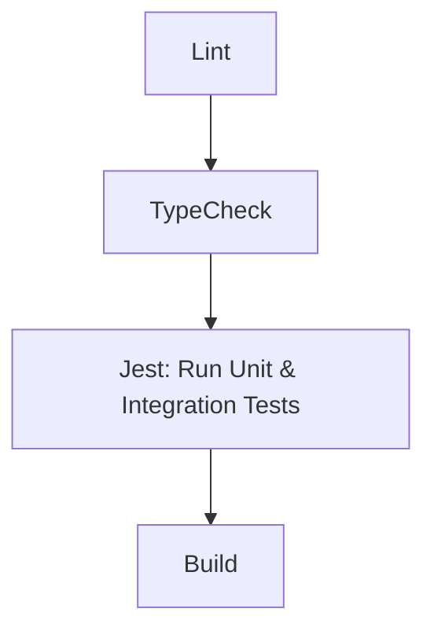
- **Coverage threshold:** ≥ 80 % lines and branches (tracked in CI).
- **Fail-fast policy:** build fails on test or coverage errors.
- **Test environment:** ephemeral PostgreSQL container seeded via Knex migrations and seed files.
- **Performance Testing:**  
  - k6 scripts under `/tests/perf/` run in CI and staging; results stored in Grafana.  
  - Thresholds: p95 latency ≤ 300 ms, error rate < 0.1 %.  
- **Frontend Performance Validation:**  
  - Lighthouse CI run per commit; fails if bundle > 300 KB or LCP > 2.5 s.  
- **Regression Policy:**  
  Any degradation > 10 % vs. baseline blocks merge until addressed.

> See §11.2.4 for CI performance gate configuration and §11.3.6 for enforcement policy.


---

## 11.2.4 Continuous Integration (CI)  ✅ *(baseline preserved + security gates added)*

CI builds multi-architecture Docker images (amd64, arm64) for Raspberry Pi compatibility.

- Runs on **GitHub Actions**:
  1. Checkout → `pnpm install` with cache restore.
  2. Run **lint → type-check → tests**.
  3. Build frontend and backend artifacts.
  4. **Security gates:**  
     - **Dependency scan:** `Snyk` and `npm audit` (fail on high severity).  
     - **Secret scan:** GitHub Advanced Security / `trufflehog`.  
     - **Container scan:** `Trivy` / `Grype` for backend & frontend images.  
  5. **Performance gates:**  
   - Run k6 smoke test (API) and Lighthouse CI (frontend).  
   - If p95 latency > 300 ms or bundle > 300 KB, build fails.  
  6. Store performance trend artifacts in CI for comparison across releases.
  7. Build Docker images and push to **GHCR**, tagged with:
     - `:sha-<commit>`
     - `:v<semver>`
     - **Digest** (sha256) recorded for immutable deploys.
  8. **Cosign sign** images and generate **SBOM**; attach as artifacts.

- CI fails if **any** stage fails (including security gates).

---

## 11.2.5 Continuous Deployment (CD)  ✅ *(baseline preserved + blue‑green + DB tasks)*

- **Manual approval required** for production deployment.
- Workflow:
  1. Connect to host via GitHub Runner (or SSH).
  2. Pull latest **signed** image digests from GHCR.
  3. Strategy: **Blue‑Green** (or Rolling) with health-checked cutover.
  4. Run:
     ```bash
     docker compose -f infra/docker/docker-compose.prod.yml up -d
     ```
  5. Apply **Knex migrations** (expand/contract).  
  6. Run **DB operational tasks**:  
     - Refresh **materialized view** `session_summary` (concurrently when possible).  
     - **Rotate partitions** (sessions, user_points, user_state_history).  
  7. Run health checks (HTTP 200, DB migration status, key queries via `pg_stat_statements`).  
  8. **Post-deploy validation:**  
   - Execute `/health`, `/metrics`, and synthetic performance probes.  
   - Rollback automatically if p95 > 350 ms or error rate > 0.5 % for 10 min.  
  9. If checks fail → rollback to previous image.

- **Rollback Command** example:
  ```bash
  docker compose -f infra/docker/docker-compose.prod.yml pull app_backend:sha-<prev-commit>
  docker compose -f infra/docker/docker-compose.prod.yml up -d
  ```

---

## 11.2.6 Documentation  ✅ *(baseline preserved)*

- **PRD**, **ERD**, and **architecture diagrams** live under `apps/docs/`.
- Changes to architecture require an **Architecture Decision Record (ADR)** in `apps/docs/`.
- All diagrams use **Mermaid syntax** to remain version-controllable.

---

## 11.2.7 DevSecOps Enhancements  🆕

- **Immutable Deployments:** only **pinned digests (sha256)** are deployed; mutable tags are not used in production.
- **Artifact Integrity:** images **signed with Cosign**, **SBOM** generated and archived per release.
- **Vault/Secrets:** production secrets resolve via **Vault/AWS Secrets Manager**; rotation at least quarterly; access logged.
- **Edge Security:** NGINX enforces **TLS 1.3 + OCSP stapling**, **HSTS**, and strict **CSP/Referrer/Permissions-Policy**.
- **Observability:** **Loki + Grafana** for logs/metrics with correlation IDs; alerts routed to **Slack/PagerDuty**.
- **Database Performance:** enable **pg_stat_statements** and track p95 query latency regressions in CI and after deploy.
- **Compliance Hooks:** GDPR deletion propagation (≤ 14 days/30 days) validated in DR drills (see § 11.3).

---

### 11.3 Governance, Security & Compliance

To maintain a **high-quality, secure, and sustainable codebase**, the following contribution rules apply.

---

#### 11.3.1 Governance

- All code changes require **peer review** and passing automated checks before merge.
- Each deployment requires **manual approval** from a release manager.
- All CI/CD executions are **logged** with timestamps and actor identity.
- **ADRs** must accompany any architecture-impacting changes (see §11.4.6 for ADR format and expectations).

#### 11.3.2 Security Controls

- **Mandatory CI Gates:** dependency (Snyk / npm audit), secret, and container vulnerability scans (Trivy / Grype) must pass.
- **Secrets Governance:** production secrets via **Vault/AWS Secrets Manager**; access logged, rotation ≥ quarterly.
- **Artifact Signing:** Docker images signed with **Cosign**; **SBOM** artifacts per release for supply-chain traceability.
- **Integrity Enforcement:** only pinned **sha256 digests** are deployable; mutable tags are not permitted in production.
- **Network & Edge:** HTTPS only; **TLS 1.3 + OCSP stapling**; **HSTS**; strict **CSP/Referrer/Permissions-Policy** at the edge.
- **Data Protection:** Encrypted backups; deletion propagation within **14 days**; account deletion **30 days**; analytics data anonymized.

#### 11.3.3 Compliance & Monitoring

- **GDPR Compliance:**  
  - User deletion triggers anonymization workflow with audit trail.  
  - Automated **DSR exports** (JSON).  
  - Redaction middleware before AI translation APIs.
- **Audit & Observability:**  
  - Centralized logs via **Loki**; dashboards via **Grafana**.  
  - Alerts via **PagerDuty/Slack** on anomalies.  
  - Use **pg_stat_statements** and Prometheus metrics for DB performance and anomaly detection.
- **Disaster Recovery:**  
  - Quarterly **failover simulation** and restore tests.  
  - **RPO ≤ 24h**, **RTO ≤ 4h** enforced via runbooks.  
  - Backup integrity validated through automated restores.
- **Supply Chain Security:**  
  - SBOM on each release; vulnerability scanning on all dependencies.  
  - CI/CD pipeline monitors for unsigned or tampered artifacts.

#### 11.3.4 CI/CD + Compliance Diagram

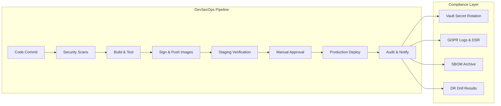

#### 11.3.5 Summary Table

| Area | Control | Tooling | Frequency |
|------|----------|----------|----------|
| Dependency Scanning | Vulnerable packages detection | Snyk / npm audit | Each build |
| Container Scanning | Base image & package CVEs | Trivy / Grype | Each build |
| Secret Management | Encrypted secrets, rotation | Vault / AWS Secrets Manager | Quarterly |
| Image Signing | Supply-chain integrity | Cosign | Each release |
| Compliance Audits | GDPR, backup, retention | Internal + External | Annual |
| Observability | Logs + metrics correlation | Grafana + Loki + Prometheus | Continuous |
| DR Testing | Failover + restore validation | Runbooks + CI job | Quarterly |

#### 11.3.6 Performance Governance

- Performance regressions > 10 % vs. baseline block release until resolved.  
- ADRs affecting caching, partitioning, or scaling must include quantified impact on p95 latency and throughput.  
- Quarterly performance audit validates KPIs and updates load baselines.  
- Performance Owner: QA Lead (responsible for KPI audits and regression triage with DevOps).

---

### 11.4 Contribution Guidelines

To maintain a **high-quality, secure, and sustainable codebase**, the following contribution rules apply. This section focuses on **developer workflow** and references §11.3 for security/compliance controls to avoid duplication.

#### 11.4.1 Branching Strategy

- **Main branch** → always production-ready.
- **Develop branch (optional)** → integrates tested features before merging to `main`.
- **Feature branches** → `feature/<scope>` (e.g., `feature/auth-2fa`).
- **Bugfix branches** → `fix/<scope>` (e.g., `fix/session-timezone`).
- **Release branches** → `release/vX.Y.Z`.
- **Hotfix branches** → `hotfix/<scope>`.

#### 11.4.2 Pull Requests (PRs)

- PRs must be reviewed by **at least one senior developer** (or owner per CODEOWNERS).
- PRs must pass the **full CI pipeline** (lint, type-check, unit/integration tests, build).
- PRs must **satisfy security gates per §11.3.2** (dependency, secret, container scans).
- PRs must include:
  - Scope of changes and rationale.
  - Related issue/ticket reference.
  - Testing performed (link to test cases, evidence).
  - If architecture-impacting, link to the **ADR** (see §11.4.6).

#### 11.4.3 Commit & Release Policy

- Commits follow **Conventional Commits** (`feat`, `fix`, `docs`, `chore`, `refactor`, etc.).
- **Semantic Versioning**:
  - **MAJOR** → incompatible API changes.
  - **MINOR** → backward-compatible features.
  - **PATCH** → backward-compatible fixes.
- Releases:
  - Tagged in GitHub (`vX.Y.Z`).
  - Docker images tagged in GHCR with **semver** and **commit SHA** (digest used for deploys).

#### 11.4.4 Code Ownership & Branch Protection

- Enforce `CODEOWNERS` with **dual review** for shared packages (frontend + backend).
- Protect `main` (and `release/*`): required reviews, required CI checks, dismiss stale approvals on new commits.
- Require **signed commits** (GPG) for maintainers and release managers.

#### 11.4.5 Security Expectations for Contributors

> To avoid duplicating §11.3, this subsection references controls rather than redefining them.

- **No secrets** committed to VCS; validate env via **zod** schemas.
- All PRs must **pass security gates** per **§11.3.2**.
- Follow the **incident & alerting** process defined in **§11.3.3** (Grafana→Slack/PagerDuty).
- Ensure a tested **rollback plan** exists for any deployment-impacting change (ref. §11.2.5).

#### 11.4.6 Documentation & ADRs

- All architecture-related changes require an **Architecture Decision Record (ADR)** in `apps/docs/adr/`.
- ADR Template must include:
  - Problem statement.
  - Considered options.
  - Final decision & rationale.
  - Consequences and trade-offs.
- **Mermaid diagrams** are the default for visual documentation.
- Cross-reference applicable controls (e.g., if the ADR affects security posture, link to **§11.3.2**).

---

## 12. Glossary

- **2FA**: Two-Factor Authentication — a second verification step (e.g., TOTP, security key) in addition to password.
- **ADR**: Architecture Decision Record — structured documentation of key technical decisions.
- **CI/CD**: Continuous Integration / Continuous Deployment — automated pipelines for building, testing, and deploying code.
- **CLS**: Cumulative Layout Shift — layout stability measure.
- **CSP**: Content Security Policy — HTTP header that restricts allowed sources of content to mitigate XSS and data exfiltration.
- **DB**: Database — persistent data store (PostgreSQL in this PRD).
- **DR**: Disaster Recovery — processes and capabilities to restore service after major incidents.
- **DSR**: Data Subject Rights — GDPR rights (access, rectification, deletion, portability).
- **ERD**: Entity-Relations Diagram
- **FE / BE**: Frontend / Backend — client-side application and server-side application layers.
- **FID**: First Input Delay — interaction responsiveness metric.
- **FR**: Functional Requirement – specifies what the system shall do.
- **GDPR**: General Data Protection Regulation — EU regulation governing data protection and privacy.
- **HSTS**: HTTP Strict Transport Security — forces browsers to use HTTPS for a domain.
- **JWT**: JSON Web Token — token format used for authentication.
- **KPI**: Key Performance Indicator — measurable target used to assess performance goals.
- **LCP**: Largest Contentful Paint — metric for perceived load speed.
- **MVP**: Minimum Viable Product — smallest feature set that delivers value to users.
- **NFR**: Non-Functional Requirement — specifies system qualities and constraints.
- **OCSP**: Online Certificate Status Protocol — mechanism to check TLS certificate revocation (often via stapling).
- **OWASP**: Open Worldwide Application Security Project — community and standards body behind the “OWASP Top 10”.
- **PII**: Personally Identifiable Information — data that can identify a person (e.g., name, email, IP, device ID).
- **p95**: 95th percentile measurement for latency or duration metrics.
- **RPO**: Recovery Point Objective — maximum acceptable data loss window in disaster recovery.
- **RTO**: Recovery Time Objective — maximum acceptable downtime for recovery.
- **RUM**: Real User Monitoring — frontend performance telemetry.
- **SBOM**: Software Bill of Materials — machine-readable inventory of components in a software artifact.
- **SCA**: Software Composition Analysis — dependency scanning to detect vulnerabilities and license issues.
- **SLO**: Service Level Objective — agreed target level for service availability or performance.
- **TLS**: Transport Layer Security — protocol for encrypted communications on the network (v1.3 referenced).
- **TOTP**: Time-based One-Time Password — algorithm for two-factor authentication.
- **TTI**: Time-to-Interactive — time until the page becomes reliably interactive for user input.
- **WCAG**: Web Content Accessibility Guidelines — international standard for digital accessibility (v2.1 AA referenced).


